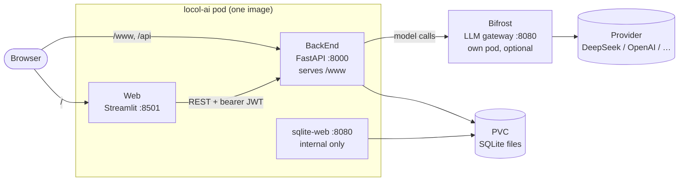
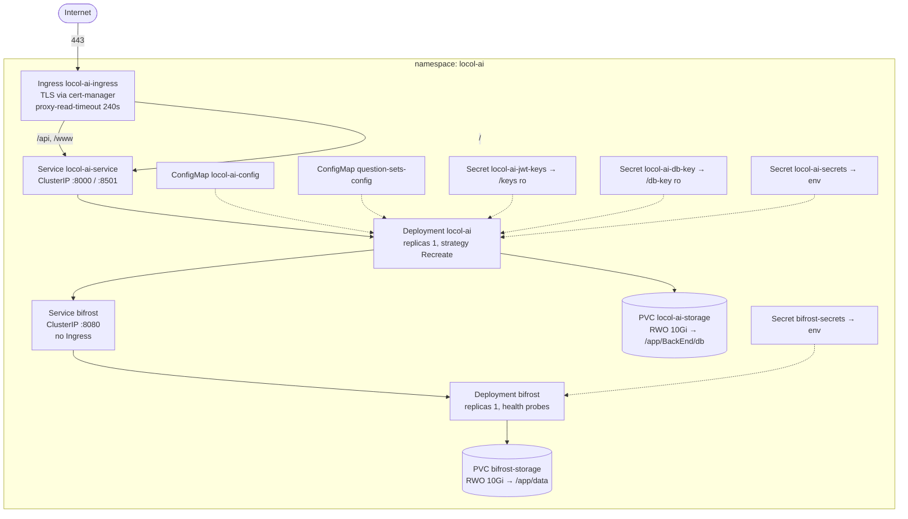
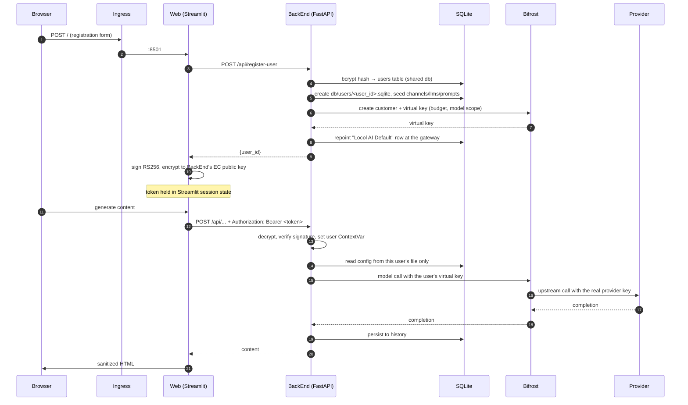
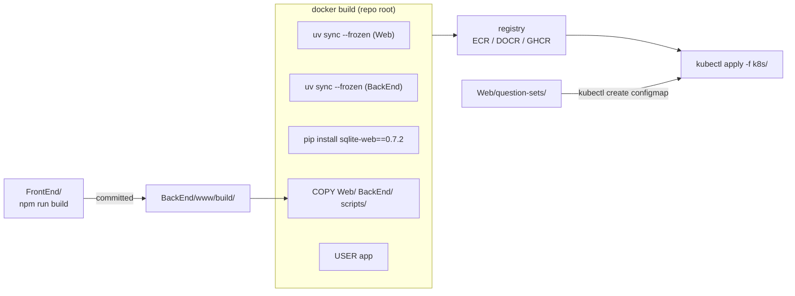

# Application architecture

What the application is made of, how the parts talk to each other, and what a
production deployment of it actually looks like. The [`k8s/`](../k8s/) manifests are
treated here as the definition of "production": where this document says *in
production*, it means the shape those manifests describe.

Note that this is an initial release of a concept. So although the code is design to be relatively scalable, by force of habit,
the currently implemented deployment takes certail shortcuts to be expedient. Examples would be to bundle all
the services into one container, and all the keys into one location and one k8s secret. The implementation is still robust,
as this document and security-management.md shows, but there is room for more robustness and scalability as we grow, and we also document that for transparency.

---

## Table of contents

- [Application architecture](#application-architecture)
  - [Table of contents](#table-of-contents)
  - [1. The short version](#1-the-short-version)
  - [2. The four components](#2-the-four-components)
    - [BackEnd — the whole of the server](#backend--the-whole-of-the-server)
    - [Web — the user-facing app, and the token issuer](#web--the-user-facing-app-and-the-token-issuer)
    - [FrontEnd — a static page with a contract](#frontend--a-static-page-with-a-contract)
    - [Bifrost — the credential boundary](#bifrost--the-credential-boundary)
  - [3. One image, three processes](#3-one-image-three-processes)
  - [4. What production looks like](#4-what-production-looks-like)
  - [5. The request path](#5-the-request-path)
  - [6. Where state lives](#6-where-state-lives)
  - [7. Configuration — three sources, in order](#7-configuration--three-sources-in-order)
  - [8. Cross-file invariants](#8-cross-file-invariants)
  - [9. Build and release](#9-build-and-release)
  - [10. Local vs production](#10-local-vs-production)
  - [11. Scaling, failure and the things that bound them](#11-scaling-failure-and-the-things-that-bound-them)
  - [12. Testing surface](#12-testing-surface)
  - [13. Architectural limits, stated plainly](#13-architectural-limits-stated-plainly)
  - [14. Where everything lives](#14-where-everything-lives)
    - [The other documents](#the-other-documents)

---

## 1. The short version

Four components, one of which is optional and one of which is not a service at all:

- **[Web](../Web)** (Streamlit) is the app a person uses. It also mints session tokens.
- **[BackEnd](../BackEnd)** (FastAPI) owns all data, all configuration and all model
  invocation. Both UI surfaces are clients of it.
- **[FrontEnd](../FrontEnd)** (Stencil/Quill) compiles to static files that BackEnd
  serves at `/www`. It has no server, no session store and no configuration.
- **[Bifrost](../bifrost/k8s/)** is a separate pod, off by default locally and on in
  production, through which every model call is routed so each user gets a
  budget-capped virtual key instead of a shared provider key.

Three properties shape everything below:

1. **The API is the only thing that touches data.** Both UIs are clients; neither
   opens a database.
2. **Every user has their own SQLite file.** Isolation is "which file gets opened",
   not a `WHERE user_id = ?` clause ([security-management.md §4](./security-management.md#4-tenancy--keeping-users-apart)).
3. **State is a single ReadWriteOnce volume**, which is what makes the app
   single-replica. Almost every other constraint follows from that one.

## 2. The four components

### BackEnd — the whole of the server

[`BackEnd/src/main.py`](../BackEnd/src/main.py) wires a FastAPI app with CORS,
`slowapi` rate limiting, the static mount of `www/`, and the `ensure_user_context`
dependency that nearly every route carries. The modules behind it group into five
concerns — auth and accounts, per-user data and config, LLM invocation, the
content-generation agents, and the Quill Delta conversion that lets generated HTML
drop straight into the editor. [`BackEnd/README.md`](../BackEnd/README.md#architecture)
lists them file by file; that list is not repeated here.

Two things about it are architecturally load-bearing rather than incidental:

- **It authenticates but never issues.** BackEnd holds `enc_private_key.pem` (to
  decrypt a token) and `public_key.pem` (to verify the signature inside it). It holds
  neither half needed to mint one. That split is a code-level discipline — see
  [§13](#13-architectural-limits-stated-plainly) for what production does and does not
  do to enforce it.
- **It is stateful only through the filesystem.** There is no cache, no queue, no
  session store. A restart loses nothing except in-flight requests.

### Web — the user-facing app, and the token issuer

[`Web/src/main.py`](../Web/src/main.py) is a Streamlit multi-page app: home, business
survey, campaign projects, config manager, find-your-voice. It calls BackEnd
**server-side** with `requests` ([`apiClient.py`](../Web/src/locol-lib/apiClient.py)),
which is why CORS is inert in the shipped configuration — no browser ever makes a
cross-origin call to the API.

Its second job is minting session tokens: [`jwt_utils.py`](../Web/src/jwt_utils.py)
holds the RSA *private* signing key and BackEnd's EC *public* encryption key, the
mirror image of what BackEnd holds. Login returns a `user_id` from the API and Web
turns it into the token ([jwt.md §4](./jwt.md#4-where-a-token-comes-from)).

Survey content is data, not code: the eight YAML files in
[`Web/question-sets/`](../Web/question-sets/) drive the question flow, and in
production they are mounted from a ConfigMap so question sets can change without an
image rebuild.

### FrontEnd — a static page with a contract

The Content Editor is compiled Stencil output committed to
[`BackEnd/www/`](../BackEnd/www) and served by FastAPI. Web hands it a project id, an
item id and a JWT in the URL *fragment*; the page moves the token into a
`SameSite=Strict` cookie, strips it from the URL, and thereafter sends it as a bearer
header like any other client. The full protocol —  bootstrap fetches, the selection
cascade, both write paths and the round trip back into the Streamlit idea list — is
[content-editor-flow.md](./content-editor-flow.md).

Architecturally the point is that it is **not a third service**. It shares BackEnd's
origin, which is what keeps the CORS allowlist empty and removes the need for a CSRF
token ([security-management.md §7](./security-management.md#7-the-network-edge)).

### Bifrost — the credential boundary

[Bifrost](https://docs.getbifrost.ai/) runs as its own Deployment in the same
namespace ([`bifrost/k8s/`](../bifrost/k8s/)). When enabled, registration provisions a
Bifrost customer and a virtual key per user, and repoints that user's `Locol AI
Default` LLM row at the gateway. The real provider key then exists only inside the
Bifrost pod — never in the app, never in a user's database. Budgets and model scoping
live with the key ([llm-keys.md §8–§11](./llm-keys.md#8-what-a-virtual-key-actually-is)).

Provisioning is get-or-create and runs again on every authenticated request via
`ensure_user_defaults_seeded()`, so it self-heals for users who registered before the
gateway existed, and costs one `SELECT` once the row holds a key. Failures are logged
with a backoff and never block a request — an unreachable Bifrost degrades model calls,
not the app.

## 3. One image, three processes

The repo-root [`Dockerfile`](../Dockerfile) builds **a single image containing both
Python applications**, and [`supervisord.conf`](../supervisord.conf) runs three
processes inside it:

| Process | Port var | Default | Exposed? |
|---|---|---|---|
| BackEnd (FastAPI) | `LOCOL_BACKEND_PORT` | 8000 | Yes — `/api` and `/www` |
| Web (Streamlit) | `LOCOL_WEB_PORT` | 8501 | Yes — everything else |
| sqlite-web | `LOCOL_SQLITE_WEB_PORT` | 8080 | **No.** Not in the Service, not in the Ingress. `kubectl port-forward` only. |

This is a deliberate trade: co-locating Web and BackEnd means one image, one rollout
and one volume, at the cost of being unable to scale or secure them independently.
The consequences show up in [§11](#11-scaling-failure-and-the-things-that-bound-them)
and [§13](#13-architectural-limits-stated-plainly).

All three run as the unprivileged `app` user (UID 1000). The image's last instruction
before `CMD` is `USER app`, supervisord has no `user=` directive to undo it, and the
Deployment asserts `runAsNonRoot` so the kubelet refuses a pod whose image ever
regresses to root.

## 4. What production looks like

One namespace, two Deployments, two volumes, one public entrance.

**The objects, and which file creates them:**

| Object | Kind | Source |
|---|---|---|
| `locol-ai` | Namespace | [`00-namespace.yaml`](../k8s/00-namespace.yaml) |
| `locol-ai-config` | ConfigMap | [`01-configmap.yaml`](../k8s/01-configmap.yaml) |
| `locol-ai-storage` | PVC (RWO, 10Gi) | [`02-storage.yaml`](../k8s/02-storage.yaml) |
| `locol-ai` | Deployment | [`03-deployment.yaml`](../k8s/03-deployment.yaml) |
| `locol-ai-service` | Service (ClusterIP) | [`04-service.yaml`](../k8s/04-service.yaml) |
| `locol-ai-ingress` | Ingress (TLS) | [`05-ingress.yaml`](../k8s/05-ingress.yaml) |
| `bifrost-storage` / `bifrost` / `bifrost` | PVC, Deployment, Service | [`bifrost/k8s/`](../bifrost/k8s/) |
| `locol-ai-jwt-keys`, `locol-ai-db-key`, `locol-ai-secrets`, `bifrost-secrets`, `question-sets-config` | Secrets + ConfigMap | **Created imperatively** — [deploy-k8s.md §4](./deploy-k8s.md#4-generate-keys-create-secrets-and-the-question-sets-configmap) |

Those last five are not in `k8s/` because they hold data that either must not be
committed (key material, provider keys) or already lives elsewhere in the repo
(`Web/question-sets/` is the single source of truth for the survey content). They must
exist before the Deployment is applied.

**Routing.** The Ingress publishes exactly three paths on one host, and addresses the
Service **by port name** rather than number:

| Path | Service port | Reaches |
|---|---|---|
| `/api` | `backend` | FastAPI |
| `/www` | `backend` | The Content Editor, served by FastAPI |
| `/` | `frontend` | Streamlit |

TLS terminates at the ingress; `ssl-redirect` and `force-ssl-redirect` are both on, so
plain HTTP is redirected rather than served. No application code enforces TLS — it is a
property of this deployment, which is why the token and password documents both
qualify their in-transit claims.

**What is deliberately not reachable.** Both Services are ClusterIP. sqlite-web is
absent from the Service entirely. Bifrost has no Ingress at all, because the same port
8080 serves both its proxy API and its admin UI, and publishing it would hand out the
provider configuration.

**Pod security.** Both Deployments set `runAsUser: 1000`, `runAsNonRoot: true`,
`allowPrivilegeEscalation: false` and `capabilities: drop: [ALL]`. `fsGroup: 1000` is
functional, not decorative: the PVC mounts over `/app/BackEnd/db` as a fresh root-owned
volume, and without the kubelet's chgrp the BackEnd cannot create per-user database
files at all — the pod starts and then fails on first login.
`readOnlyRootFilesystem` is *not* set, because `uv run` resolves the virtualenv at
startup, Streamlit writes under `$HOME`, and supervisord writes a pidfile; that is
recorded as accepted residual risk in
[security-management.md](./security-management.md#gaps-with-no-other-home).

## 5. The request path

A first-time user, end to end:

Four checkpoints on that path are worth naming, because each is a single place the
whole property depends on:

| Checkpoint | Where | What it guarantees |
|---|---|---|
| Token verification | `get_current_user_from_token` → [`jwt_auth.py`](../BackEnd/src/jwt_auth.py) | The caller is who the token says |
| User context | [`ensure_user_context`](../BackEnd/src/main.py#L116-L125) | Every subsequent query opens *that user's* file, and the request fails rather than guessing |
| Path derivation | [`get_user_db_path`](../BackEnd/src/db_manager.py#L15-L36) | A user id can never escape `db/users/` |
| Spend ceiling | Bifrost virtual key | A leaked token cannot cost more than the key's budget |

`ensure_user_context` is applied per-route, so a new `/api/` route added without it
would be public and untenanted.
[`tests/test_route_auth.py`](../BackEnd/tests/test_route_auth.py) walks the route table
and fails the suite if that happens, with a two-entry allowlist for register and login.

## 6. Where state lives

Everything the application persists sits under one mount point, on one volume.

| What | Path | Contents |
|---|---|---|
| Shared accounts database | `db/persistent_data.sqlite` | Usernames, emails, bcrypt hashes |
| Per-user databases | `db/users/<user_id>.sqlite` | Projects, ideas, surveys, generated content, voices, history, and that user's channels / LLMs / prompt templates — LLM API keys Fernet-encrypted |
| Bifrost state | `/app/data` on its own PVC | Provider configuration, request logs, optional semantic cache |

Three consequences:

- **Per-user configuration is a copy, not a reference.** The YAML in
  [`BackEnd/config/default/`](../BackEnd/config/default/) is *seed* data seeded into each
  new user's tables at registration. Editing the YAML later does not change existing
  users; `ensure_user_defaults_seeded()` repairs missing or empty tables, and
  `load_llms.py` deliberately skips rows already holding a Bifrost virtual key so a
  resync cannot revert someone's routing.
- **The users table and the encrypted keys share a volume.** A backup of
  `locol-ai-storage` therefore contains both. The Fernet key must not be backed up
  alongside it — the two together give up everything
  ([llm-keys.md §14](./llm-keys.md#14-what-this-protects-against--and-what-it-doesnt)).
- **Losing the volume loses the application.** There is no other copy of user data.
  Snapshot it.

Non-persistent by design: session state (Streamlit in-process), the rate limiter's
counters (in-memory, per replica), and everything under `/tmp`.

## 7. Configuration — three sources, in order

Configuration reaches a process from three places, and which one you reach for depends
on what the value is:

| Source | Holds | Changing it needs |
|---|---|---|
| Image `ENV` ([Dockerfile](../Dockerfile)) | Port defaults that make `supervisord.conf` resolve at all | A rebuild |
| `locol-ai-config` ConfigMap | URLs, timeouts, key mount points, Bifrost settings, rate limits, CORS | A rollout |
| Secret volumes and `envFrom` | Key material (`/keys`, `/db-key`, read-only), provider and admin tokens | A rollout — `envFrom` resolves at pod start |

Two rules are worth internalising:

**Key material is never an environment variable.** The two key secrets are mounted as
read-only volumes and the app is told only *where to look*
(`LOCOL_JWT_KEYS_LOCATION`, `LOCOL_DB_ENCRYPTION_KEY_LOCATION`). Environment variables
carry only the tokens that are not themselves the crown jewels.

**Most ConfigMap keys are read as `optional: true`.** That is not laziness: the image
carries its own default for each, so a cluster still running an older ConfigMap keeps
starting rather than crash-looping. The exceptions are the keys with no sensible
default (`LOCOL_API_URL`, `LOCOL_WWW_URL`, the two key locations) and the
`question-sets-config` ConfigMap *volume*, which is deliberately non-optional — a
missing ConfigMap holds the pod in `ContainerCreating` with a clear event, whereas
`optional: true` would silently mount an empty directory over the baked-in files and
break every survey at runtime instead.

The full variable reference lives in
[BackEnd/README.md](../BackEnd/README.md#configuration) and
[deploy-local.md §9](./deploy-local.md#9-configuration-reference).

## 8. Cross-file invariants

A handful of settings are duplicated across files that cannot read each other. Each is
commented at both ends in the source; they are collected here because they are the
things most likely to be broken by an otherwise reasonable edit.

| Invariant | The files that must agree | What breaks |
|---|---|---|
| A port number | [`01-configmap.yaml`](../k8s/01-configmap.yaml) `LOCOL_*_PORT` ↔ `containerPort` in [`03-deployment.yaml`](../k8s/03-deployment.yaml) | YAML can't read env vars. Service and Ingress address ports *by name*, so they need no edit — but the kubelet publishes one number and the process binds another. |
| The LLM timeout chain | `LOCOL_LLM_REQUEST_TIMEOUT` (180) **<** `proxy-read-timeout` (240) in [`05-ingress.yaml`](../k8s/05-ingress.yaml) | nginx gives up first and the user sees an opaque 504 instead of the app's own message. Raise both together. |
| The container UID | `useradd --uid 1000` in [`Dockerfile`](../Dockerfile) ↔ `runAsUser`/`fsGroup` in both Deployments | The PVC isn't writable; per-user databases can't be created. |
| The marker LLM name | `Locol AI Default` in [`llm.yaml`](../BackEnd/config/default/llms/llm.yaml) ↔ [`bifrost_manager.py`](../BackEnd/src/bifrost_manager.py) | Provisioning silently finds nothing to repoint. |
| The model prefix | `LOCOL_BIFROST_DEFAULT_MODEL` ↔ a provider entry configured *inside* Bifrost | Every provisioned user's first model call fails with "no keys found for provider". The Secret alone is not enough — Bifrost does not discover providers from the environment. |
| The JWT key set | All **four** PEMs in `locol-ai-jwt-keys` | A secret predating the encrypted-token change has only two. The pod starts — nothing validates the contents — and then 500s on every authenticated request. |
| The feature flag pair | `LOCOL_FIND_YOUR_VOICE_ENABLED` on both Web and BackEnd | The form is offered and then answered with "unavailable". |
| Supervisord's port vars | `ENV` in the Dockerfile ↔ `%(ENV_...)s` in [`supervisord.conf`](../supervisord.conf) | supervisord refuses to start if one resolves to nothing. Override them; never clear them. |

## 9. Build and release

Points worth knowing:

- **The editor's build output is committed.** `BackEnd/www/build/` must be in the repo
  for the image to contain it. If it is missing, `index.html` still loads, the
  dropdowns still work, and the Quill custom elements never register — the editor
  renders nothing, with no console error and no failed API call. `main.py` prints a
  loud `[WARN]` at startup for exactly this reason.
- **Dependencies are installed from committed lockfiles** (`uv sync --frozen`).
  `--no-cache` is load-bearing rather than an optimisation: the syncs run as root while
  the container runs as `app`, and a root-owned `/tmp/uv-cache` makes the first
  `uv run` at startup die with a permission error.
- **The question-sets ConfigMap is created from the repo directory**, not from a
  manifest, so `Web/question-sets/` stays the single source of truth. The mount
  replaces the whole directory, so the ConfigMap must carry every file in it — all
  eight.
- **Pin the Bifrost image**; use a released version, not `:latest`. The locol-ai image
  is the opposite case (`imagePullPolicy: Always` against a moving tag).
- **There is no CI.** Building, scanning, testing and applying are all manual. See
  [security-management.md §9](./security-management.md#9-checking-our-own-work).

## 10. Local vs production

The same code, with four structural differences:

| | Local | Production (k8s) |
|---|---|---|
| Processes | Two, started by hand or by `run-web-debug.ps1` | Three, under supervisord in one pod |
| Keys | Generated into `keys/` by `scripts/setup-local.*` | Secrets mounted read-only at `/keys` and `/db-key` |
| Bifrost | Off (`LOCOL_BIFROST_URL` unset) — the provider key from `llm.yaml` is used directly | On — per-user virtual keys, $5/month default cap |
| Survey content | Read from `Web/question-sets/` | Mounted from a ConfigMap |
| TLS | None | Terminated at the ingress, HTTP redirected |
| Question of who you are | Same: register an account, get a token | Same |

Setup and troubleshooting for the local path is [deploy-local.md](./deploy-local.md).

> **The manifests in [`k8s/`](../k8s/) are templates.** A real deployment's
> environment-specific manifests live outside version control (a gitignored `local/`),
> and can override anything described here — including the security-relevant settings.
> Reading this document is not the same as reviewing what is actually running.

## 11. Scaling, failure and the things that bound them

**The app is not horizontally scalable, and the volume is why.** SQLite on a
ReadWriteOnce PVC means one pod can mount it. Hence `replicas: 1`, and hence
`strategy: Recreate` rather than the default RollingUpdate — a rolling update would
deadlock waiting for a volume the outgoing pod still holds. The visible cost is a few
seconds of downtime on every rollout.

Three consequences fall out of that, and they are easy to mistake for bugs:

- **Rate limits are per-replica**, because `slowapi`'s counters are in process memory.
  With one replica that is exact; it silently stops being exact the moment a second
  one exists.
- **Streamlit session state is per-replica** for the same reason. Any future
  multi-replica deployment needs sticky sessions or an external session store.
- **A rollout logs nobody out.** Tokens are self-contained and verified against a
  mounted key, not against server-side state — which is also why the only way to revoke
  one is to rotate the keypair and log everyone out
  ([jwt.md §11](./jwt.md#11-what-this-protects-against--and-what-it-doesnt)).

**Health checking is asymmetric.** Bifrost has readiness and liveness probes on
`/health`, because it sits in the request path of every model call and must be pulled
out of its Service the moment it stops answering. The locol-ai Deployment has **no
probes at all** — a wedged process is restarted by supervisord if it exits, but a pod
that is up and not serving stays in the Service.

**Timeouts are a chain, deliberately ordered.** Model latency is measured in minutes,
so the app allows 180s, nginx allows 240s, and the app's own message reaches the user
before the proxy's does. Bifrost's governance calls during registration have their own
short timeout (`LOCOL_BIFROST_TIMEOUT`, 5s × up to four calls), which bounds how long a
signup can hang if the gateway is unreachable.

**Failure modes, by blast radius:**

| What fails | What happens |
|---|---|
| Bifrost pod | Model calls fail; registration is slow but completes; everything else works |
| Provider upstream | Model calls fail with a provider error; retried with backoff on 429 |
| BackEnd process | supervisord restarts it; Web shows connection errors meanwhile |
| The PVC | Total data loss. Restore from a snapshot. |
| A key secret | JWT keys: everyone is logged out. DB key: every stored provider key becomes undecryptable — this one is not disposable. |

## 12. Testing surface

Three layers, all run by hand:

| Suite | Scope | Run from |
|---|---|---|
| [`BackEnd/tests/`](../BackEnd/tests) | Session-token format, and the rule that every `/api/` route requires a token. Hermetic — a fixture generates throwaway keypairs, so no `keys/`, no database, no running service. | `BackEnd/` (`main.py` mounts `www/` by relative path at import time) |
| [`QualityAssurance/`](../QualityAssurance) | Playwright page objects driving the real UI — login, surveys, campaign projects, config manager, and the Content Editor. Needs both services running. | `QualityAssurance/` |
| [Bearer](https://docs.bearer.com/) | Static analysis over first-party source, scoped by [`bearer.yml`](../bearer.yml) with a triage record in [`bearer.ignore`](../bearer.ignore). | `scripts/run-bearer-scan.*` |

`run-bearer-scan.sh --fail` exits non-zero on any finding — the hook a CI job would
use. Nothing invokes it.

## 13. Architectural limits, stated plainly

These are structural, not bugs. Each is the cost of a decision made deliberately
elsewhere in this document.

- **One replica, and no path to more** without replacing SQLite. Per-user database
  files are what make tenancy leak-proof; they are also what pin the app to one node's
  volume.
- **Web and BackEnd share a pod and a filesystem.** The key split that makes BackEnd
  incapable of minting a token is real in the code and *not* enforced by this
  deployment: all four PEMs sit in one secret mounted into one pod, so anything with
  shell access there can both mint and decrypt. Splitting them into two Deployments
  with a secret each is what would make the boundary real.
- **Tenancy rests on one dependency.** `ensure_user_context` is applied per route, so a
  route added without it is public by default. The test suite is what converts that
  convention into a check.
- **sqlite-web ships in the image.** An unauthenticated database admin UI is one
  Service edit away from being public. It is excluded from the Service and the Ingress;
  nothing structurally prevents someone adding it.
- **The seed `llm.yaml` is tracked by git** and seeds every user with whatever key it
  contains. Prefer setting a real key in the app, or Bifrost, which removes the question.
- **No CI, no dependency audit, no secret scanning, no automated updates.**
  Dependencies are declared with `>=` floors and committed `uv.lock` files, so
  reproducibility depends on installs honouring the lockfile.
- **No backups are automated.** Snapshotting `locol-ai-storage` is an operator
  responsibility, and the encryption key must be stored somewhere else.

## 14. Where everything lives

| Concern | Location |
|---|---|
| API, routes, middleware | [`BackEnd/src/main.py`](../BackEnd/src/main.py) |
| Per-user database resolution | [`BackEnd/src/db_manager.py`](../BackEnd/src/db_manager.py) |
| Token verification | [`BackEnd/src/jwt_auth.py`](../BackEnd/src/jwt_auth.py) |
| Token minting | [`Web/src/jwt_utils.py`](../Web/src/jwt_utils.py) |
| Web → API client | [`Web/src/locol-lib/apiClient.py`](../Web/src/locol-lib/apiClient.py) |
| Bifrost provisioning | [`BackEnd/src/bifrost_manager.py`](../BackEnd/src/bifrost_manager.py) |
| Seed configuration | [`BackEnd/config/default/`](../BackEnd/config/default/) |
| Survey content | [`Web/question-sets/`](../Web/question-sets/) |
| Content Editor source / build | [`FrontEnd/`](../FrontEnd) → [`BackEnd/www/`](../BackEnd/www) |
| Image and process supervision | [`Dockerfile`](../Dockerfile), [`supervisord.conf`](../supervisord.conf) |
| Production manifests (templates) | [`k8s/`](../k8s/), [`bifrost/k8s/`](../bifrost/k8s/) |
| Setup and key generation | [`scripts/`](../scripts/) |

### The other documents

| Document | Owns |
|---|---|
| [how-to-use.md](./how-to-use.md) | The user-facing workflow, stage by stage |
| [deploy-local.md](./deploy-local.md) | Running it on a workstation; what each key is |
| [deploy-k8s.md](./deploy-k8s.md) | The operator procedure for the deployment described in §4 |
| [security-management.md](./security-management.md) | The security layers, and the register of gaps |
| [jwt.md](./jwt.md) | Session tokens end to end |
| [password-hashing.md](./password-hashing.md) | Identity |
| [llm-keys.md](./llm-keys.md) | Provider credentials, virtual keys, budgets |
| [content-editor-flow.md](./content-editor-flow.md) | The editor's wire protocol |
