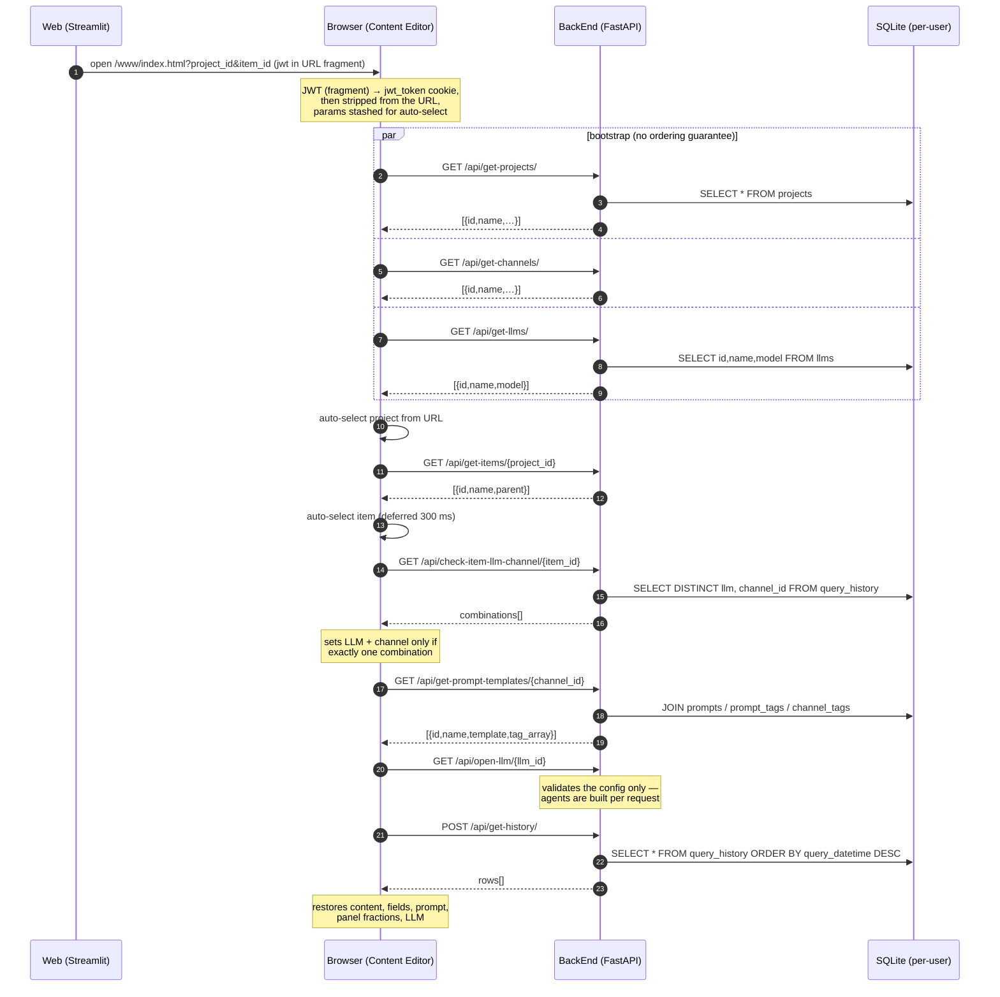
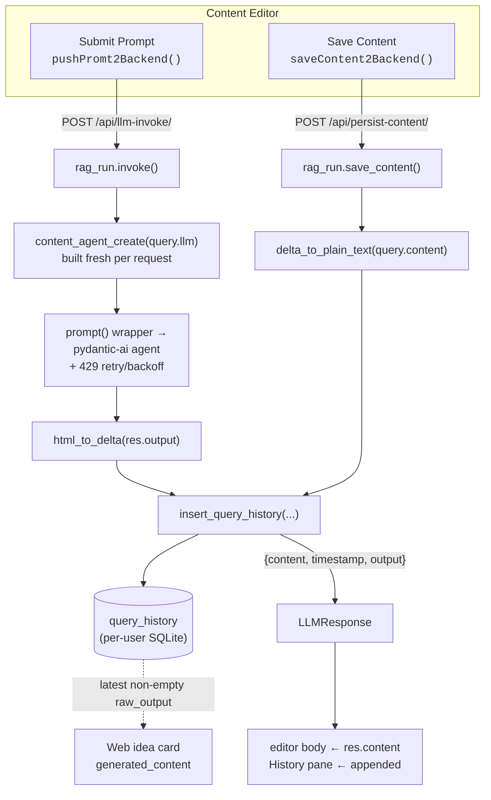

# Content Editor — interface and process flow

The **Content Editor** is the rich-text authoring surface where generated content
gets reviewed, re-prompted, and saved. Its source lives in
[`FrontEnd/`](../FrontEnd) (plain JavaScript on top of a vendored
[stencil-quill](https://github.com/KillerCodeMonkey/stencil-quill) build); the
compiled output is committed to [`BackEnd/www/`](../BackEnd/www) and served by
the FastAPI service as static files at `/www/index.html`.

It is **not** a standalone service. It has no server of its own, no session store
and no environment configuration — it is a static page that calls `BackEnd`'s
REST API relative to whatever origin served it, authenticated by a JWT handed to
it by [`Web`](../Web).

This document records that interface: what `Web` hands over, which endpoints fire
in what order, the shape of each payload, and how an edit made in the editor
finds its way back into the Streamlit idea list. A [findings](#findings) section
at the end lists the defects turned up while tracing the flow that are still
open — the ones that have since been fixed have been removed from it.

---

## Table of contents

- [1. Entry — the handoff from Web](#1-entry--the-handoff-from-web)
- [2. Bootstrap — three parallel fetches](#2-bootstrap--three-parallel-fetches)
- [3. The selection cascade](#3-the-selection-cascade)
- [4. Prompt assembly](#4-prompt-assembly)
- [5. The two write paths](#5-the-two-write-paths)
- [6. Round trip back to Web](#6-round-trip-back-to-web)
- [7. What gets persisted per interaction](#7-what-gets-persisted-per-interaction)
- [8. Build and deploy relationship](#8-build-and-deploy-relationship)
- [Findings](#findings)

---

## 1. Entry — the handoff from Web

The editor is reached from a **📝 Content Editor** link button on a campaign
idea card in the Streamlit app. The button is rendered only when the idea has
non-empty `generated_content`
([`Web/src/locol-lib/projectSurvey.py:1211-1213`](../Web/src/locol-lib/projectSurvey.py#L1211-L1213)) —
which is why the Stage 4 card on the Web landing page is labelled
*"🔒 Opens from inside a Campaign Project once you've generated content for an
idea."*

The URL is built at
[`projectSurvey.py:1291`](../Web/src/locol-lib/projectSurvey.py#L1291):

```python
content_editor_url = f"{LOCOL_WWW_URL}/www/index.html?project_id={project_id}&item_id={idea_id}#jwt={jwt_token}"
```

Three things ride on that URL, and they are the entire contract:

| Parameter | Meaning |
|---|---|
| `project_id` | The campaign project. Matches a row in the user's `projects` table. |
| `item_id` | The **brainstorm idea id**, which is also the `items` row id. |
| `jwt` | Session token minted by `Web` at login — an RS256-signed JWT sealed in an ECDH-ES+A256KW JWE, so its contents are opaque to this page ([jwt.md](./jwt.md)). In the **fragment**, not the query string — browsers never transmit a fragment, so it stays out of access logs and `Referer` headers. The editor strips it from the URL as soon as it reads it. |

`LOCOL_WWW_URL` comes from
[`Web/src/locol-lib/apiClient.py:5`](../Web/src/locol-lib/apiClient.py#L5)
(default `http://localhost:8000`). The editor itself needs no environment
variables at all.

**Why `item_id` is the idea id.** When the user generates content for selected
ideas, [`generate_project_items.py`](../BackEnd/src/generate_project_items.py)
persists each idea as a `DropDownItem` whose `id` is the idea's own id and whose
`parent` is the project. That shared identifier is what lets the editor's item
dropdown, the `query_history` rows, and the Web idea card all refer to the same
thing.

On load, `captureSessionToken()` in
[`auth.js`](../FrontEnd/src/includes/auth.js) — the first script the page
loads — copies the JWT into a `jwt_token` cookie
(`path=/; max-age=86400; SameSite=Strict`, plus `Secure` over https) and then
`history.replaceState()`s the token out of the URL.
`getUrlParameters()` in [`dynamic-dropdowns.js`](../FrontEnd/src/includes/dynamic-dropdowns.js#L10-L20)
keeps `project_id`/`item_id` for auto-selection. From then on every request
attaches the token as a bearer header:

```js
headers['Authorization'] = `Bearer ${jwt}`;
```

On the server, each API route depends on `ensure_user_context`
([`BackEnd/src/main.py:116-125`](../BackEnd/src/main.py#L116-L125)), which verifies
the token — decrypting it with `enc_private_key.pem`, then checking the signature
inside against `public_key.pem` — sets the current user in a `ContextVar`, and
repairs any missing default channels/LLMs/prompts. All subsequent SQLite access
is routed to that user's own database file.

## 2. Bootstrap — three parallel fetches

Three independent `fetch` calls fire at script-parse time, each constructing a
`Dropdown` inside its own `.then()`:

| Endpoint | Dropdown | Editable? |
|---|---|---|
| `GET /api/get-projects/` | Project | yes — add / rename / delete |
| `GET /api/get-channels/` | Channel | read-only (`readOnly=true`) |
| `GET /api/get-llms/` | LLM | read-only |

The item dropdown is created empty alongside the project dropdown and populated
later by the cascade.

`GET /api/get-llms/` uses a dedicated reader,
[`retrieve_llm_dropdown_values()`](../BackEnd/src/persist_data.py#L148-L172),
that projects only `id, name, model` — the `APIkey` column (Fernet-encrypted at
rest) is deliberately never sent to the browser.

There is no ordering guarantee between these three fetches. See
[finding 2](#2-bootstrap-race-on-deep-link).

## 3. The selection cascade

Every dropdown selection funnels through the same method,
[`Dropdown.updateSelectedEntry()`](../FrontEnd/src/includes/dynamic-dropdown-class.js#L122-L134),
which does three things: records the selection, invokes that dropdown's own
`refreshSelection` callback, and then calls the shared, cross-file
`refreshScreenContent()`.



| Selection | `refreshSelection` callback | Endpoint | Effect |
|---|---|---|---|
| **Project** | `refreshItemDropdown` | `GET /api/get-items/{parent}` | Repopulates the item list; clears item, channel and LLM selections. |
| **Item** | `checkItemLLMChannelCombos` | `GET /api/check-item-llm-channel/{item_id}` | Auto-selects LLM + channel **only if exactly one** `(llm, channel_id)` combination exists in `query_history`; otherwise clears both. |
| **Channel** | `refreshPromptList` | `GET /api/get-prompt-templates/{channel_id}` | Loads matching prompt templates and builds the tag-filter dropdowns. |
| **LLM** | `openSelectedLLM` | `GET /api/open-llm/{llm}` | Validates that the model and its key are usable, so a bad config surfaces at selection time rather than on the first Submit. Retains no state — `llm-invoke` builds its own agent from the `llm` in the request body. |
| *(any)* | `refreshScreenContent` | `POST /api/get-history/` | Restores the last saved state for `(project, item, channel)`. |

### Deep-link auto-selection

`autoSelectFromUrlParams()` finds the project in the fetched list and calls
`selectSpecificEntry()`, which runs the normal click path. Because items load
asynchronously, the requested `item_id` is parked on `window.autoSelectItemId`
and applied from inside the items callback after a 300 ms `setTimeout` — one of
three timing-based coordination points in the file (100 ms, 300 ms, 1000 ms).

### How prompt templates are matched to a channel

[`get_prompt_templates()`](../BackEnd/src/prompt.py#L37-L58) joins
`prompts → prompt_tags → channel_tags`: a prompt is offered for a channel when
they share at least one tag. Each row comes back with a JSON `tag_array`.

The browser then splits those tags on `:` into `key:value` groups
([`dynamic-filter.js`](../FrontEnd/src/includes/dynamic-filter.js)), renders one
checkbox dropdown per key, and filters the list client-side — no further server
round trip. Tags without a colon land in a "General Items" group.

### `refreshScreenContent()` — restoring prior state

Guarded on project, item **and** channel all being selected
([`dynamic-fields.js:220-224`](../FrontEnd/src/includes/dynamic-fields.js#L220-L224)),
it POSTs to `/api/get-history/` and, from the newest row, restores:

- the editor body (`response`, a Quill Delta),
- the dynamic field values (`fields`),
- the prompt template selection (`prompt_id`, retried once after 1 s if the
  prompt list hasn't loaded yet),
- the pane layout (`panel_fractions`),
- the LLM dropdown (`llm`).

It also rebuilds the History pane by replaying every row oldest-first.

## 4. Prompt assembly

This is the least obvious part of the interface and worth stating precisely.

1. **Select a template.** `selectPromptEntry()`
   ([`prompt-window.js:23-42`](../FrontEnd/src/includes/prompt-window.js#L23-L42))
   loads the template text into the Prompt Editor pane and scans it with
   `extractBracedStrings()`
   ([`dynamic-fields.js:86-110`](../FrontEnd/src/includes/dynamic-fields.js#L86-L110)),
   a brace-counting parser that returns the distinct `{Placeholder}` names.

2. **Generate the input fields.** `createContentFields()` renders one
   `<textarea id="field_<Name>">` per placeholder into the *Prompt Input* pane,
   carrying prior values across template switches through the `content_save`
   array (`[{id, value}]`).

   `{Content}` is special-cased: it gets **no** textarea, because it is filled
   from the editor body itself. That is what makes iterative prompting work —
   "rewrite this shorter" style templates feed the current draft back in.

3. **Substitute and submit.** On submit, the *live* Prompt Editor text (the user
   may have edited the template in place) is re-scanned, each `{Name}` is
   replaced with its textarea's value, and the assembled string is sent as
   `query`. `{Content}` is the exception: it takes the live editor body as
   semantic HTML from `getLiveQuillHtml()`
   ([`dynamic-fields.js:182-194`](../FrontEnd/src/includes/dynamic-fields.js#L182-L194)).
   HTML rather than plain text because the model is told to reply in the same
   small tag set and its reply comes back through `html_to_delta()` — so bold,
   lists and headings survive each pass of iterative prompting.

## 5. The two write paths

Both buttons POST the same eleven-field
[`LLMQuery`](../BackEnd/src/models.py#L5-L16), built from the same live reads of
the two Quill panes, and both end up inserting a row into `query_history`. The
only difference is the endpoint: whether an LLM is involved, and what lands in
`content` / `response` / `raw_output`.



### Submit Prompt → `POST /api/llm-invoke/`

- The assembled `query` is wrapped in the HTML-constrained system prompt from
  [`prompt.py:23-34`](../BackEnd/src/prompt.py#L23-L34) — the LLM is told to
  emit only `p, b, i, em, u, a, ul, ol, br, h1, h2`.
- The pydantic-ai agent runs with exponential backoff on HTTP 429, honouring a
  server-supplied `Retry-After` when present
  ([`llm.py:162-254`](../BackEnd/src/llm.py#L162-L254)).
- The HTML response is converted to a Quill Delta by
  [`html_to_delta()`](../BackEnd/src/quill_html_to_delta.py) and stored as
  `response`; the raw HTML is stored as `raw_output`.
- The Delta returns as `res.content` and **replaces** the editor body, and is
  appended to the History pane under a timestamp separator.

### Save Content → `POST /api/persist-content/`

- No LLM call. The Delta comes from the same `getLiveQuillContent()` read and is
  stored as both `content` and `response`.
- `raw_output` is set to `delta_to_plain_text(content)`
  ([`quill_op.py:5-19`](../BackEnd/src/quill_op.py#L5-L19)) — deliberately, so a
  hand-edited draft is visible to the Web round trip described next.

> Both paths read the editor through
> [`getLiveQuillContent()`](../FrontEnd/src/includes/dynamic-fields.js#L170-L180),
> never the `.content` Stencil prop, which reflects only programmatic writes and
> so lags whatever the user has typed since.

## 6. Round trip back to Web

There is exactly one return path, and it is a single query.

[`get_project_brainstorm_ideas()`](../BackEnd/src/project_brainstorming_ideas.py#L136-L149)
loads each stored idea and then overlays the newest non-empty `raw_output` for
that `(project_id, item_id)`:

```sql
SELECT raw_output FROM query_history
 WHERE project_id = ? AND item_id = ? AND raw_output IS NOT NULL AND raw_output != ''
 ORDER BY query_datetime DESC
 LIMIT 1
```

The result becomes the idea's `generated_content`. Two consequences worth
holding onto:

- It is why `save_content()` bothers to write plain text into `raw_output` at
  all. If it wrote an empty string, manual edits would be invisible to Web and
  the card would keep showing the original LLM draft.
- It is why [`htmlSanitize.py:117-123`](../Web/src/locol-lib/htmlSanitize.py#L117-L123)
  must handle both shapes: **HTML** when the row came from `llm-invoke`, **plain
  text** when it came from `persist-content`.

Note the granularity: `query_datetime` is stored as
`"%Y-%m-%d %H:%M:%S"` text, so two writes within the same second order
arbitrarily.

## 7. What gets persisted per interaction

Every Submit or Save appends one row to `query_history`
([`persist_history.py:13-33`](../BackEnd/src/persist_history.py#L13-L33)). It is
an append-only log — nothing is ever updated in place, and "the current state of
an item" is by definition its newest row.

| Column | Contents |
|---|---|
| `project_id`, `item_id`, `channel_id` | The three-part key `get-history` selects on. |
| `prompt_id` | Selected template, used to re-highlight it on reload. |
| `content` | Editor body as a live Quill Delta — the same read on both paths. |
| `fields` | JSON of the `content_save` array — the dynamic textarea values. |
| `llm` | The LLM id the request asked for, which is the one that served it. |
| `prompt_template` | Live Delta of the Prompt Editor, i.e. the possibly hand-edited template. Write-only — the reload path restores the template from `prompt_id` instead. |
| `query` | The fully substituted prompt actually sent to the model. |
| `response` | Quill Delta shown in the editor. |
| `panel_fractions` | JSON pane layout captured by [`getPanelFractions()`](../FrontEnd/src/includes/grid-master.js#L99-L118), so the resizable grid is restored per item. |
| `rag_on_off` | Always `false` from the editor — the RAG toggle is commented out in the UI, and `invoke()`'s RAG branch is a stub (it passes `NO_RETRIEVED_CONTEXT`; no retriever is wired up). |
| `raw_output` | HTML (LLM path) or plain text (save path) — the one column Web reads. |

## 8. Build and deploy relationship

`FrontEnd/` compiles straight into `BackEnd/www/` via the `www` output target in
[`stencil.config.ts`](../FrontEnd/stencil.config.ts), which also copies
`src/includes/` verbatim — including `includes/vendor/`, which holds the
third-party runtime assets (Quill, intro.js) the page used to pull from CDNs.
`BackEnd` mounts that directory at `/www`
([`main.py:102`](../BackEnd/src/main.py#L102)).

The built output is **committed**, and `FrontEnd/` is excluded from the Docker
build — by image-build time the compiled assets already live under
`BackEnd/www/`. So the editor works from a fresh clone with no Node toolchain;
you only run `npm run build` if you change its source.

Two caveats when you do:

- **Both trees have to move together.** `BackEnd/www/` is what FastAPI serves, and
  it is tracked, so an edit to `FrontEnd/src/includes/*.js` that isn't mirrored
  there changes nothing a user sees. Because the output target copies `includes/`
  **verbatim**, a straight file copy is equivalent to a build for those files;
  `index.html` differs only by minification.
- **Bump the `?v=` cache-buster in both `index.html` files** whenever an
  `includes/*.js` file changes — every occurrence, so the bundle moves as a unit.
  It is a hand-maintained timestamp (no hook installs it), and without the bump a
  returning browser can keep serving the old script from cache.

---

## Findings

Defects and rough edges found while tracing the flow that are still open. The
ones fixed during and before this pass — the process-wide content agent, stale
content on Submit Prompt, the JWT in the query string, `/api/set-screen`, the
triplicated auth helpers, the unguarded `updateSelectedLLM()`, the
`String.replace` placeholder substitution and the missing LLM rate limits — have
been removed. Where a fix left something deliberately uncovered, that residue is
recorded below on its own.

### 1. The session cookie is script-readable

The JWT reaches the editor in the URL **fragment** and `captureSessionToken()`
([`auth.js`](../FrontEnd/src/includes/auth.js)) `history.replaceState()`s it out
of the URL as soon as it is copied into the `jwt_token` cookie
(`SameSite=Strict`, plus `Secure` over https). What it cannot be is `HttpOnly`:
every request authenticates with an `Authorization: Bearer` header built in JS,
so the cookie has to stay readable from script.

Closing that means moving the whole API to cookie-based auth — every endpoint's
auth path and every `fetch` call. The exposure that remains is an
XSS-equivalent one; the access-log, `Referer` and browser-history exposure is
gone.

`Secure` is conditional deliberately: set on plain `http://localhost` the
browser drops the cookie and every API call 401s.

### 2. Bootstrap race on deep-link

Auto-selection runs inside the `/api/get-projects/` callback, but the channel and
LLM dropdowns are built by two *independent* fetches.
`setLLMAndChannelSelections()` null-guards and silently no-ops if they haven't
resolved yet.

A deep-linked user can therefore land with no channel selected — which blocks
`refreshScreenContent()` (it requires all three of project, item and channel) and
shows an **empty editor for an item that has history**. Reproducing it needs only
a slow `/api/get-channels/` response relative to `/api/get-projects/`.

### 3. The batch path substitutes with Python's `str.format()`

[`generate_project_items.py:67`](../BackEnd/src/generate_project_items.py#L67)
fills its template with `template.format(Title=…, Description=…, Goal=…, Platform=…,
ContentType=…)`. That replaces every occurrence and does not expand `$`, so it
avoids the traps the editor's `split`/`join`
[`substitutePlaceholder()`](../FrontEnd/src/includes/dynamic-fields.js#L87-L94)
was written to sidestep — but it is strict about braces in a way the editor's
substitution is not. Config Manager lets users author prompt templates, and
`str.format()` raises `KeyError` on any placeholder outside that fixed set and
`ValueError` on a stray `{` or `}` — a JSON example in a template is enough.

It is contained: `process_generate_project_items()` catches per idea and records a
`generation_error`, so one bad template fails one idea rather than the request. The
shipped `project-item-generation.yaml` uses only `{Title}`, `{Description}` and
`{Goal}`, and the `reddit_*` templates cannot be selected here because the lookup
matches on a `platform:` tag they do not carry.

### 4. Dropdown edits rewrite the whole table

[`replace_dropdown_values()`](../BackEnd/src/persist_data.py#L9-L67) deletes every
row (or every row under a parent) and re-inserts whatever array the client sent.
So:

- adding, renaming or deleting one project round-trips the entire project list;
- two editor tabs open on the same account will clobber each other's additions —
  last writer wins, wholesale;
- deleting an item does not cascade to `project_brainstorm_ideas` or
  `query_history`, leaving orphaned rows that Web continues to render as idea
  cards.

Conversely, projects and items *created* in the editor have no survey or
brainstorm-idea record behind them, so they never appear in the Web UI.

### 5. Rate limiting is per-replica

The LLM endpoint limits (`LOCOL_LLM_RATE_LIMIT=20/minute`,
`LOCOL_LLM_BATCH_RATE_LIMIT=5/minute`, keyed by authenticated user via
[`_user_rate_limit_key()`](../BackEnd/src/main.py#L81-L88)) use slowapi's
**in-memory** storage. That is right for the single replica in
`k8s/03-deployment.yaml`, but the counters live in the process — with two
replicas each would allow the full quota. Scaling out needs a shared backend
(Redis) first.

Related, and also uncovered: the Google Fonts stylesheet is still a third-party
request. A stylesheet cannot execute script, and SRI is impractical there
because Google varies the response by user agent.

### 6. History rendering is string surgery on JSON

`appendHistoryDisplay()`
([`dynamic-fields.js:277-284`](../FrontEnd/src/includes/dynamic-fields.js#L277-L284))
concatenates Deltas with `content.slice(1,-1)`, which assumes the content is a
bare `[...]` ops array rather than `{"ops": [...]}`.

This is a load-bearing assumption: it is exactly why `getLiveQuillContent()` must
return `quill.getContents().ops` and not the Delta object. Worth knowing before
"tidying" either function.

### 7. `readOnly=true` at the call sites is an implicit global

[`dynamic-dropdowns.js:98`](../FrontEnd/src/includes/dynamic-dropdowns.js#L98)
and [`:107`](../FrontEnd/src/includes/dynamic-dropdowns.js#L107) call
`new Dropdown(..., res, readOnly=true)`. JavaScript has no named arguments —
that is an assignment expression creating a global `readOnly` variable, whose
value `true` is then passed positionally. It happens to do the right thing, and
reads as though it were intentional syntax.
