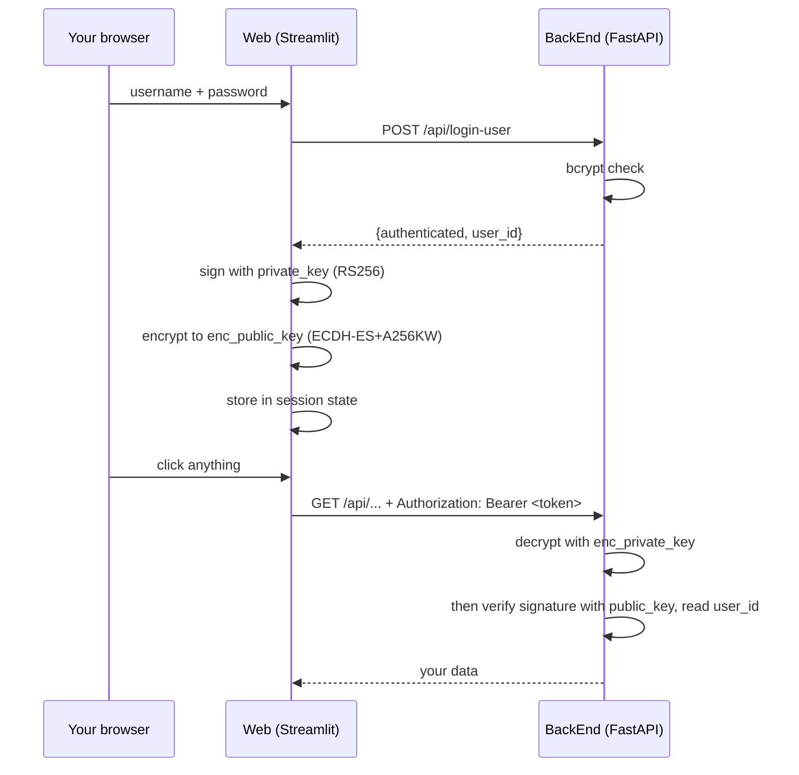

# How we keep you logged in — JWTs in plain English

This is a plain-English explanation of what happens *after* you log in: how the app
remembers who you are on every click that follows, without asking for your password
again. It's written so you don't need a security background to follow it. Every claim
links to the code that backs it, so a developer can check the explanation against
reality.

Its companion is [password-hashing.md](./password-hashing.md), which covers the other
half of the story — proving who you are in the first place. This one picks up the
moment that proof succeeds.

---

## Table of contents

- [How we keep you logged in — JWTs in plain English](#how-we-keep-you-logged-in--jwts-in-plain-english)
  - [Table of contents](#table-of-contents)
  - [1. The short version](#1-the-short-version)
  - [2. What's actually inside a token](#2-whats-actually-inside-a-token)
  - [3. Why we use them here](#3-why-we-use-them-here)
    - [Why the signature can't be dropped](#why-the-signature-cant-be-dropped)
  - [4. Where a token comes from](#4-where-a-token-comes-from)
  - [5. Carrying it — the bearer header](#5-carrying-it--the-bearer-header)
  - [6. The browser hop](#6-the-browser-hop)
  - [7. Checking it on the way in](#7-checking-it-on-the-way-in)
  - [8. A second job — fair rate limiting](#8-a-second-job--fair-rate-limiting)
  - [9. The keys](#9-the-keys)
  - [10. Where the code lives](#10-where-the-code-lives)
  - [11. What this protects against — and what it doesn't](#11-what-this-protects-against--and-what-it-doesnt)

---

## 1. The short version

A **JWT** — JSON Web Token, usually said "jot" — is a small piece of text the server
hands you when you log in, which you then show on every later request instead of your
password.

The useful analogy is a **festival wristband**. You queue at the gate once, show ID,
and get a wristband. Every bar and stage after that just glances at the wristband: no
phone call back to the gate, no lookup in a list. It works because the band carries a
tamper-proof seal — you can't make one yourself, and you can't alter the one you have
without the damage showing. And it expires: at the end of the weekend it's just a bit
of fabric.

Ours goes one step further: the wristband is handed over in a **sealed opaque
envelope** addressed to `BackEnd`. You carry it, you present it, but you can't read
what's written on the band itself — and neither can anyone who takes it off you.

That gives the four properties worth remembering:

| Property | What it means here |
|---|---|
| **Self-contained** | The token itself says which user you are. The server doesn't look you up in a table of live sessions — there is no such table in this project. |
| **Sealed** | It carries a cryptographic signature. Change one character of the user id and the signature stops matching, and the request is rejected. |
| **Opaque** | The signed part is then *encrypted* to `BackEnd`. Only `BackEnd` can read the contents — see section 2, and section 6 for why that matters. |
| **Expiring** | Ours are stamped with a 24-hour lifetime and stop working after that. |

The alternative — a server-side session table — would mean a database row per logged-in
user and a lookup on every request. The wristband approach costs a signature check
instead, which matters here because the piece of the app that *issues* your token and
the piece that *checks* it are two separate services (section 3).

## 2. What's actually inside a token

Ours is a **nested** JWT — one token wrapped inside another. Start with the inner one,
because it is the ordinary case.

A plain signed JWT is three chunks of text joined by dots:

```
eyJhbGciOiJSUzI1NiIsInR5cCI6IkpXVCJ9.eyJ1c2VyX2lkIjoiYTNmOS0uLi4iLCJleHAiOjE3NTc.hK2n9Vv…
└──────── header ────────┘ └──────── payload ────────┘ └── signature ──┘
```

The **header** says which algorithm sealed it. The **payload** is the actual claim —
who you are. The **signature** is the seal over the first two.

The payload we put in is deliberately tiny, built at
[`jwt_utils.py:59-63`](../Web/src/jwt_utils.py#L59-L63):

```python
claims = {
    "user_id": user_id,
    "exp": int((now + timedelta(hours=expires_hours)).timestamp()),
    "iat": int(now.timestamp()),
}
```

Three fields: **who** (`user_id`), **when it dies** (`exp`, 24 hours by default), and
**when it was minted** (`iat`, "issued at"). No username, no email, no roles — nothing
the backend can't look up for itself once it knows the user id.

> **The thing everyone gets wrong about JWTs: a signed payload is *encoded*, not
> *encrypted*.** Those chunks are Base64, which is a formatting convention, not a lock.
> Anyone holding a plain signed token can paste it into any JWT decoder and read the
> contents. The signature doesn't hide the payload — it makes the payload
> **unforgeable**, which is a different guarantee.
>
> That is exactly why we don't stop there.

So the signed token above is then **encrypted** into a second, outer token, and it is
the outer one that actually travels. That gives five chunks instead of three:

```
eyJhbGciOiJFQ0RILUVTK0EyNTZLVyIsImVuYyI6IkEyNTZHQ00i….Xk7p….3JqA….9vT2mB….fE1sQ…
└────────── header ──────────┘ └─ key ─┘ └─ iv ─┘ └ ciphertext ┘ └─ tag ─┘
```

Only the header is readable. The **ciphertext** is the entire signed token from above,
encrypted; the **key** and **iv** are what `BackEnd` needs to undo that; the **tag**
proves nothing was altered in transit. The header names the two algorithms used:

| Field | Value | What it does |
|---|---|---|
| `alg` | `ECDH-ES+A256KW` | How the one-time content key is agreed and wrapped, using `BackEnd`'s EC key |
| `enc` | `A256GCM` | How the content itself is encrypted — AES-256 in GCM mode |
| `cty` | `JWT` | Says the decrypted content is itself a JWT ([RFC 7519 §5.2](https://www.rfc-editor.org/rfc/rfc7519#section-5.2)) |
| `epk` | *(a public key)* | A fresh single-use public key, minted per token — see section 3 |

The practical upshot: **the `user_id` is no longer readable by anyone holding the
token.** A token is about 990 characters and looks like noise. Section 6 explains why
that was worth doing — the short version is that we hand this token to your browser.

Two consequences of `exp` living *inside* the signed payload are unchanged: it can't be
edited to buy more time, and expiry is checked purely by reading the token — no database
involved.

## 3. Why we use them here

This project is split into two Python services that don't share a database:

- **`Web`** — the Streamlit app you actually click on, which owns the login form.
- **`BackEnd`** — the FastAPI service that owns your data and does the real work.

`Web` establishes who you are, and `BackEnd` needs to believe it, over an HTTP call
between them. A JWT is the message that carries that belief.

The signing uses **RS256** — an RSA *key pair* rather than a single shared password.
That distinction is the point of the design:

| Key | Who holds it | What it can do |
|---|---|---|
| `private_key.pem` | `Web` only | **Sign** tokens |
| `public_key.pem` | `BackEnd` only | **Verify** signatures — and nothing else |
| `enc_public_key.pem` | `Web` only | **Encrypt** a token to `BackEnd` |
| `enc_private_key.pem` | `BackEnd` only | **Decrypt** tokens — and nothing else |

Read that table carefully: the halves are held **crosswise**. Each service holds one
private key and one public key, so neither service can both mint a token and read one.
See the four loaders — [`load_private_key()`](../Web/src/jwt_utils.py#L29-L38) and
[`load_enc_public_key()`](../Web/src/jwt_utils.py#L41-L49) in `Web`,
[`load_public_key()`](../BackEnd/src/jwt_auth.py#L65-L74) and
[`load_enc_private_key()`](../BackEnd/src/jwt_auth.py#L76-L84) in `BackEnd`.

The simpler alternative for signing (HS256, one shared secret both sides hold) would
work, but every service holding the secret could forge a token for any user. Splitting
the pair keeps the ability to say "this is user X" in exactly one place.

### Why the signature can't be dropped

This is the part worth writing down, because it is counter-intuitive and the temptation
to "simplify" is real: **encryption alone would not authenticate anything.**

`ECDH-ES` is *anonymous* encryption. To encrypt a token to `BackEnd` you need only
`BackEnd`'s **public** key, and that is the whole input — there is no sender key
involved, which is why each token carries a fresh throwaway `epk` instead. So if the
token were encrypted and *not* signed, anyone who obtained `enc_public_key.pem` could
manufacture a perfectly valid token claiming any `user_id` they liked, and `BackEnd`
would have nothing to check it against. Decrypting a token successfully proves only
that it was encrypted *to us*. It says nothing about **who wrote it**.

That matters more here than in most systems, because this token is the entire
authorization model. There is no second ownership check anywhere in `BackEnd` — as
section 7 shows, verifying the token is also what *selects which database file you
get*. A forgeable token would therefore be a compromise of every account at once.

So the two layers do two different jobs, and both are load-bearing:

| Layer | Algorithm | Guarantee |
|---|---|---|
| Inner signature | RS256 | **Authenticity** — only `Web` could have written this |
| Outer encryption | ECDH-ES+A256KW / A256GCM | **Confidentiality** — only `BackEnd` can read it |

And the order is not arbitrary: **sign first, then encrypt.** On the way back in,
`BackEnd` decrypts and only then checks the signature. Signing the ciphertext instead
would prove only that someone signed an opaque blob, not that they authored the claim
inside it.

## 4. Where a token comes from

Logging in takes two steps in two different services, on purpose.

**Step one — check the password.** `Web` POSTs your username and password to
[`POST /api/login-user`](../BackEnd/src/main.py#L420-L428). That endpoint only compares
the bcrypt hash (see [password-hashing.md](./password-hashing.md)) and answers
`{authenticated, user_id}`. It issues no token, and the code says so at
[main.py:426-427](../BackEnd/src/main.py#L426-L427):

```python
# If login successful and authenticated, the web frontend should create the JWT token
# The backend just returns the user_id for the web to create the token
```

**Step two — mint the token.** `Web` takes the returned `user_id` and signs it, at
[`Web/src/main.py:111-113`](../Web/src/main.py#L111-L113):

```python
if result.get("authenticated"):
    user_id = result.get("user_id")
    jwt_token = create_jwt_token(user_id)
```

`create_jwt_token()` ([jwt_utils.py:52-75](../Web/src/jwt_utils.py#L52-L75)) builds the
payload from section 2, signs it, and then seals the result in the envelope:

```python
inner = jwt.JWT(header={"alg": JWS_ALG, "typ": "JWT"}, claims=claims)
inner.make_signed_token(load_private_key())

outer = jwt.JWT(
    header={"alg": JWE_ALG, "enc": JWE_ENC, "typ": "JWT", "cty": "JWT"},
    claims=inner.serialize(),
)
outer.make_encrypted_token(load_enc_public_key())
return outer.serialize()
```

The signed token becomes the *claims* of the outer one — that is all "nested" means
here. Note `claims` on the inner token is a dict and on the outer one a string; the
outer token's content is the compact serialization of the inner, not JSON.

The token is then kept in Streamlit's **server-side session state** —
[`Web/src/main.py:148-151`](../Web/src/main.py#L148-L151) — initialised to `None` at
[:52-53](../Web/src/main.py#L52-L53) and cleared on logout at
[:233](../Web/src/main.py#L233). It isn't in a browser cookie at this stage; it lives on
the `Web` server, attached to your session.



## 5. Carrying it — the bearer header

Every call from `Web` to `BackEnd` attaches the token to the standard
`Authorization` header. "Bearer" is the HTTP convention for *whoever bears this token
gets treated as its subject* — like the wristband, it isn't tied to your face.

There is exactly one place in `Web` that builds it,
[`apiClient.py:39-44`](../Web/src/locol-lib/apiClient.py#L39-L44):

```python
def get_api_headers():
    """Get headers with JWT token for API calls"""
    headers = {"Content-Type": "application/json"}
    if hasattr(st.session_state, 'jwt_token') and st.session_state.jwt_token:
        headers["Authorization"] = f"Bearer {st.session_state.jwt_token}"
    return headers
```

Roughly forty call sites across `Web/src/` use it, and none build the header themselves.
Note that a call made without a token silently sends no header rather than raising — the
request goes out and comes back a 401 from the other end.

## 6. The browser hop

One feature breaks the two-service pattern: the **Content Editor** is a page that runs
in your browser and talks to `BackEnd` directly, so it needs its own copy of the token.

`Web` passes it in the link, at
[`projectSurvey.py:1305`](../Web/src/locol-lib/projectSurvey.py#L1305):

```python
content_editor_url = f"{LOCOL_WWW_URL}/www/index.html?project_id={project_id}&item_id={idea_id}#jwt={jwt_token}"
```

Look at the `#`. The token rides in the URL **fragment**, not the query string, and the
comment at [:1298-1304](../Web/src/locol-lib/projectSurvey.py#L1298-L1304) explains why:
browsers never transmit the fragment to a server. A `?jwt=` would be written into the
ingress access log on every request and leak through the `Referer` header; a `#jwt=`
never leaves the browser.

On arrival, [`auth.js`](../FrontEnd/src/includes/auth.js) — the single owner of
browser-side token handling — takes over in `captureSessionToken()`
([:11-39](../FrontEnd/src/includes/auth.js#L11-L39)). It reads the token, stores it in a
cookie ([:29-30](../FrontEnd/src/includes/auth.js#L29-L30)):

```js
const secure = window.location.protocol === 'https:' ? '; Secure' : '';
document.cookie = `jwt_token=${jwt}; path=/; max-age=86400; SameSite=Strict${secure}`;
```

`max-age=86400` is 24 hours, matching the token's own `exp`. `Secure` is conditional
because setting it over plain `http://localhost` makes the browser discard the cookie
outright and every call 401s in local development.

Then it scrubs the token out of the address bar and the history entry
([:34-36](../FrontEnd/src/includes/auth.js#L34-L36)) via `history.replaceState()`, so a
copied URL or a shoulder-surfed screen doesn't hand it on. From there
[`getAPIHeaders()`](../FrontEnd/src/includes/auth.js#L54-L66) rebuilds the same bearer
header the Python side sends.

**This hop is why the token is encrypted.** Everything else in this document happens
between two servers we run. Here the token is written into a URL that a browser
navigates to and then parked in a cookie that JavaScript can read by design — it has to
be, since `auth.js` reads it back to build the header. With a plain signed JWT, the
`user_id` sat one Base64 decode away from anyone who opened DevTools, and from any
script running on the page. Now the whole thing is ciphertext, and the only party that
can read it is the service it is addressed to.

Note what does *not* change: `auth.js` never looks inside the token. It captures it,
stores it, and replays it as an opaque string, so the encryption layer needed no
frontend change at all.

## 7. Checking it on the way in

Verification is one function,
[`decode_jwt_token()`](../BackEnd/src/jwt_auth.py#L86-L138), and it undoes the two
layers in order:

```python
if token.count('.') != 4:
    raise HTTPException(status_code=401, detail="Invalid token: expected an encrypted token…")

outer = jwt.JWT(key=enc_key, jwt=token, expected_type="JWE", algs=_JWE_ALGS)
inner = jwt.JWT(key=verify_key, jwt=outer.claims, algs=_JWS_ALGS)
payload = json.loads(inner.claims)
user_id = payload.get("user_id")
```

**First the segment count.** A three-segment token is a bare signed JWT — the format
used before the encryption layer existed. Those are still perfectly signature-valid and
always will be, so they have to be refused on *format*, or they would keep working
forever and quietly defeat the change. That check is what makes the cutover a real one.

**Then decryption**, which either yields the inner token or fails. Every input to that
step is attacker-controlled and every failure means the same thing, so all of them
become a 401.

**Then the signature**, plus the claim check jwcrypto runs with it: it confirms the
signature was made by the matching private key, rejects an `exp` in the past, and
refuses any algorithm other than RS256. A tampered token, an expired one, or one signed
with a different key all come back as a 401 — "Token has expired" or "Invalid token".

> **Why the catch clause is `except (JWException, TypeError, ValueError)` and not just
> `except JWException`.** Most of what can go wrong above arrives as a `JWException` —
> a tampered ciphertext or auth tag becomes `InvalidJWEData`. But not all of it: an
> `expected_type` mismatch raises a bare `TypeError`, and a payload that decrypts to
> something which isn't a JWS surfaces as a `ValueError` from the JSON parse. Miss
> either and a flipped byte returns **500** instead of 401 — which is exactly what
> happened during development, caught by the tamper tests. There are tests pinning both
> paths now.

One deliberate exception to that 401 rule: if a **key file** is missing or malformed,
that is a deployment fault, not a bad token, and it returns a **500** with
`Server authentication key is not configured` plus a logged `[ERROR]` naming the path.
This used to be swallowed into a 401 "Token verification failed", which meant an
unmounted key volume looked exactly like every user suddenly having a bad token — a
genuinely expensive thing to debug.

Both algorithm choices are pinned, and for the same reason: an attacker controls the
header, so an unrestricted verifier lets them nominate the algorithm it will accept.
Every call passes an explicit list — `algs=["RS256"]` for the signature,
`algs=["ECDH-ES+A256KW", "A256GCM"]` for the envelope (one list covers both `alg` and
`enc`).

This is **not** something the library gets right by default. jwcrypto's
`default_allowed_algs` is deliberately broad — it includes `dir`, which skips key
agreement altogether, bare `ECDH-ES`, and the password-based `PBES2-*` family — so
omitting `algs` would accept all of them.
[`test_algorithm_substitution_is_rejected`](../BackEnd/tests/test_jwt_auth.py) mints a
genuine `dir` token using that permissive default and asserts the verifier refuses it,
so the pin cannot be quietly dropped.

There are two ways to ask for the user behind a request:

| Helper | Behaviour | Used by |
|---|---|---|
| [`get_current_user_from_token`](../BackEnd/src/jwt_auth.py#L141-L145) | Strict — raises 401 if the token is missing or bad | Every authenticated route |
| [`get_user_from_header`](../BackEnd/src/jwt_auth.py#L148-L161) | Lenient — returns `None` instead of raising | The rate limiter (section 8) |

Routes don't depend on either directly. They depend on `ensure_user_context`
([main.py:116-125](../BackEnd/src/main.py#L116-L125)), which sits on top of the strict
helper and does the thing that makes the whole scheme useful:

```python
async def ensure_user_context(user_id: str = Depends(get_current_user_from_token)):
    """Ensure user context is set for database operations using JWT authentication"""
    set_current_user(user_id)
```

Every user has their own SQLite database file, and `set_current_user()` is what points
all subsequent database access at *yours*. So the token isn't only a gate — it's what
selects the data you see. Around 48 routes declare
`user_id: str = Depends(ensure_user_context)`, from
[`/api/load-buttons/{button}`](../BackEnd/src/main.py#L127-L128) onward.

Exactly **two** endpoints skip it, and they have to:
[`/api/register-user`](../BackEnd/src/main.py#L414-L418) and
[`/api/login-user`](../BackEnd/src/main.py#L420-L428) are how you get a token in the
first place. Both are rate-limited (5/hour and 10/minute) precisely because anyone can
reach them.

That "exactly two" is now enforced rather than asserted.
[`tests/test_route_auth.py`](../BackEnd/tests/test_route_auth.py) walks every route the
app registers and fails if an `/api/` path lacks the dependency and isn't one of those
two. It exists because a third endpoint, `/api/current-user`, had sat unauthenticated
among the others for a long time without anything noticing — it has since been deleted
(it only ever echoed back the caller's own id). A future route added without the
dependency now breaks the suite instead of going unnoticed.

## 8. A second job — fair rate limiting

The endpoints that call an LLM cost real money per request, so they're capped. The
interesting part is *what* the cap counts against, at
[`_user_rate_limit_key()`](../BackEnd/src/main.py#L81-L88):

```python
user_id = get_user_from_header(request.headers.get("Authorization"))
return f"user:{user_id}" if user_id else _rate_limit_key(request)
```

The obvious key would be your IP address, but as the comment at
[:82-86](../BackEnd/src/main.py#L82-L86) notes, colleagues in one office share one
public IP and would eat each other's budget. A valid token identifies the account
actually spending the credit, so it makes the fairer key; requests without a usable
token fall back to the IP key ([:72-79](../BackEnd/src/main.py#L72-L79)) since they're
about to be rejected anyway. The limits themselves are 20 LLM calls a minute and 5 batch
calls ([:94-95](../BackEnd/src/main.py#L94-L95)).

This is also why token verification had to be made cheap. The limiter's key function runs
*before* the route's own dependency, so a rate-limited endpoint decodes the same token
**twice** per request. Reading and parsing a PEM file from disk each time was the cost
that fixed — hence the cache on every key loader:

```python
@lru_cache(maxsize=1)
def load_public_key():
```

The keys are mounted at startup and never change at runtime, so one read each is enough.
All four loaders carry this now; adding the decryption key doubled the per-decode file
reads that would otherwise have happened, on the hottest path in the service.

> Worth knowing if you ever write a test that swaps the keys: because the loaders are
> cached, changing `LOCOL_JWT_KEYS_LOCATION` after one has already run has no effect
> until you call `.cache_clear()` on it. The suite's fixture does exactly that
> ([tests/conftest.py](../BackEnd/tests/conftest.py)) — without it the tests pass while
> silently using the wrong keys, which is the kind of green build nobody questions.

## 9. The keys

Two key pairs — one per layer — are generated once per deployment, by either of two
equivalent scripts: [`generate-jwt-keys.sh`](../scripts/generate-jwt-keys.sh) (OpenSSL)
or [`generate-jwt-keys.ps1`](../scripts/generate-jwt-keys.ps1) (pure .NET, so stock
PowerShell needs no OpenSSL install). Both write the same four files into repo-root
`keys/`, which is gitignored and dockerignored:

| File | Contents | Which service needs it |
|---|---|---|
| `private_key.pem` | RSA private key, PKCS#1, unencrypted, `chmod 600` | `Web` — signs |
| `public_key.pem` | Matching public key, SubjectPublicKeyInfo | `BackEnd` — verifies |
| `enc_private_key.pem` | EC P-256 private key, SEC1, unencrypted, `chmod 600` | `BackEnd` — decrypts |
| `enc_public_key.pem` | Matching public key, SubjectPublicKeyInfo | `Web` — encrypts |

The RSA size is configurable (`--key-size` / `-KeySize`, default 2048). The curve is
not: P-256 is fixed by the `ECDH-ES+A256KW` choice.

> The `.ps1` script encodes both key formats by hand, because .NET's PEM export helpers
> (`ExportRSAPrivateKeyPem`, `ExportECPrivateKeyPem`) are .NET 5+ and this has to run on
> stock Windows PowerShell 5.1. If you touch that DER encoder, check the output actually
> loads — a subtly wrong encoding produces a *valid-looking* PEM that fails later.

All four files live in one directory, which both services find through
`LOCOL_JWT_KEYS_LOCATION`, defaulting to `'../keys'`
([jwt_auth.py:40-41](../BackEnd/src/jwt_auth.py#L40-L41),
[jwt_utils.py:25-26](../Web/src/jwt_utils.py#L25-L26)). Each service reads only the two
files it needs, but nothing stops it reading the others — see section 11.

> That default is resolved against the **process working directory**, not against the
> Python file. It only lands on repo-root `keys/` because `BackEnd` runs with its working
> directory set to `BackEnd\` and `Web` to `Web\` — spelled out at
> [run-web-debug.ps1:141-146](../run-web-debug.ps1#L141-L146). A *relative* override has
> to be joined against the consuming service's own directory to predict what the app will
> actually open.

In Kubernetes the four files are one secret volume: `LOCOL_JWT_KEYS_LOCATION: "/keys"` in
[01-configmap.yaml:32](../k8s/01-configmap.yaml#L32), injected as env at
[03-deployment.yaml:119-123](../k8s/03-deployment.yaml#L119-L123), mounted read-only at
[:212-214](../k8s/03-deployment.yaml#L212-L214) from the `locol-ai-jwt-keys` secret
declared at [:237-239](../k8s/03-deployment.yaml#L237-L239).

The volume takes the whole secret rather than an `items:` list, so all four files arrive
without this manifest knowing their names — but equally, a secret created before the
encryption layer existed carries only two and nothing in the manifests notices. The pod
starts and then 500s on every authenticated request;
[deploy-k8s.md §4](./deploy-k8s.md#4-generate-keys-create-secrets-and-the-question-sets-configmap)
covers the upgrade order.

Regenerating the pairs is cheap — it invalidates every live session and everyone logs in
again. Nothing else is lost. The one hard rule is that both services must point at the
same four files, or every request fails. See
[deploy-local.md §4](./deploy-local.md#41-the-keys-it-generates) for the setup steps.

## 10. Where the code lives

| Concern | Location |
|---|---|
| Minting a token (sign + encrypt) | [`create_jwt_token`](../Web/src/jwt_utils.py#L52-L75) — jwt_utils.py:52-75 |
| Loading the signing key | [`load_private_key`](../Web/src/jwt_utils.py#L29-L38) — jwt_utils.py:29-38 |
| Loading the encryption key | [`load_enc_public_key`](../Web/src/jwt_utils.py#L41-L49) — jwt_utils.py:41-49 |
| The login flow that calls it | [`login_user`](../Web/src/main.py#L95-L127) — Web/src/main.py:95-127 |
| Building the bearer header (Python) | [`get_api_headers`](../Web/src/locol-lib/apiClient.py#L39-L44) — apiClient.py:39-44 |
| Building it (browser) | [`getAPIHeaders`](../FrontEnd/src/includes/auth.js#L54-L66) — auth.js:54-66 |
| The browser handoff | [`captureSessionToken`](../FrontEnd/src/includes/auth.js#L11-L39) — auth.js:11-39 |
| Verifying a token (decrypt + verify) | [`decode_jwt_token`](../BackEnd/src/jwt_auth.py#L86-L138) — jwt_auth.py:86-138 |
| Loading the decryption key | [`load_enc_private_key`](../BackEnd/src/jwt_auth.py#L76-L84) — jwt_auth.py:76-84 |
| The dependency every route uses | [`ensure_user_context`](../BackEnd/src/main.py#L116-L125) — BackEnd/src/main.py:116-125 |
| Rate-limit key by user | [`_user_rate_limit_key`](../BackEnd/src/main.py#L81-L88) — BackEnd/src/main.py:81-88 |
| Key generation | [generate-jwt-keys.sh](../scripts/generate-jwt-keys.sh) / [.ps1](../scripts/generate-jwt-keys.ps1) |
| Tests — token format | [tests/test_jwt_auth.py](../BackEnd/tests/test_jwt_auth.py) |
| Tests — every route is authenticated | [tests/test_route_auth.py](../BackEnd/tests/test_route_auth.py) |

Supporting facts:

- One library does both layers: [jwcrypto](https://pypi.org/project/jwcrypto/), with
  `cryptography` doing the underlying RSA and EC work. Its `JWT` class handles nested
  sign-then-encrypt as a first-class pattern, so both layers are built and unwrapped
  through the same API and its errors share one `JWException` base.
- This replaced an earlier pairing of PyJWT (signature) and Authlib (envelope). PyJWT has
  no JWE support at all, so it could only ever do half the job; and `authlib.jose` is
  deprecated as of Authlib 1.7.0 and slated for removal in 1.8, which forced a `<1.7`
  pin. Since `fastmcp` also depends on authlib in `BackEnd`, that pin would have become an
  unsatisfiable conflict the moment fastmcp's floor rose. Both packages still appear in
  `BackEnd/uv.lock` as transitive dependencies of `mcp` and `fastmcp`; neither is used by
  the token path.
- The two implementations are wire-compatible in both directions — a token minted by the
  authlib version verifies under jwcrypto and vice versa — which is why that migration
  needed no re-issue and logged nobody out.
- Token lifetime is the `expires_hours=24` default of `create_jwt_token`, and no caller
  overrides it.
- `exp` and `iat` must be **integer** timestamps. PyJWT used to convert `datetime` objects
  silently and jwcrypto does not, so
  [jwt_utils.py](../Web/src/jwt_utils.py) builds them with `int(...timestamp())`.
- The 24-hour cookie `max-age` in `auth.js` is a separate hardcoded number that happens
  to match. Change one and you should change the other.
- A token is roughly 990 characters, up from about 470 before the encryption layer.
  Still well inside the ~4KB cookie limit and fine in a URL fragment.

## 11. What this protects against — and what it doesn't

**It protects against forged and tampered requests.** Nobody can hand `BackEnd` a token
claiming to be another user, because minting one requires the private key, which only
`Web` has. Editing an existing token — swapping in a different `user_id`, pushing `exp`
further out — breaks the signature and the request is rejected.

**It protects against a stolen token being useful forever.** Twenty-four hours after
issue, it's fabric.

**It protects the contents from everyone but `BackEnd`.** The `user_id` inside is not
readable by the browser holding the token, by a script running on the editor page, or by
anyone who intercepts it. That is what the encryption layer buys, and it is the reason
the change was made — see section 6.

**It does not stop a stolen token being used.** This is the limit worth being clear
about, because encryption is easy to over-read: a bearer token is still exactly like a
wristband. Whoever holds it *is* you, for as long as it lives. Encrypting the contents
means a thief can't *read* your user id — it does nothing to stop them *presenting* the
token. Keeping it off the wire is still TLS's job, which is a deployment concern (see
[deploy-k8s.md](./deploy-k8s.md)) and not enforced by application code.

Some honest gaps in the current implementation:

> **No refresh, and no revocation.** Nothing renews a token, so a Streamlit session older
> than 24 hours simply starts returning 401s and you log in again. More importantly,
> nothing can *cancel* a token early: logout clears the client's copy
> ([Web/src/main.py:233](../Web/src/main.py#L233)), but a token already copied elsewhere
> keeps working until it expires. That's the price of the wristband design — the gate
> isn't consulted again. Undoing a compromise today means regenerating the key pair,
> which logs everyone out.
>
> **The editor's cookie is readable by scripts.** It cannot be `HttpOnly`, because
> `auth.js` has to read it back to build the bearer header. Recorded as an accepted
> residual risk at
> [content-editor-flow.md §1](./content-editor-flow.md#1-the-session-cookie-is-script-readable)
> — the remaining exposure is XSS-equivalent; the access-log, `Referer` and history
> exposure is gone.
>
> **The payload carries no `iss`, `aud`, `jti` or `nbf`.** Nothing marks which deployment
> a token was minted for, so two environments sharing a key pair would accept each
> other's tokens; and with no `jti` there's no id a revocation list could name. The
> encryption layer does not change this.
>
> **Both private keys sit unencrypted on disk** (`password=None` at
> [jwt_utils.py:43-45](../Web/src/jwt_utils.py#L43-L45)). Anyone who can read
> `private_key.pem` can mint a token for any `user_id`; anyone who can read
> `enc_private_key.pem` can read every token. File permissions and the k8s secret mount
> are the only thing guarding them. This is an implementation issue rather than an
> application issue. A later release can implement a more robust seperation of the
> services and of the keys.
>
> **The crosswise key split is a code-level discipline, not a deployment boundary.**
> Section 3's table describes which service *uses* which half — but in the container
> image `supervisord` runs both services in **one** pod, with **all four** files in the
> **same** mounted secret. So anything with shell access in that pod can read every key,
> and can therefore both mint a token and read one. The separation is real protection
> against a bug in one service, and no protection at all against access to the pod.
> Deploying the two services separately with two secrets is what would make it a real
> boundary.
>
> **Rate-limit counters are per-replica**, so the per-user ceilings of section 8 multiply
> if the deployment scales out — see
> [content-editor-flow.md §5](./content-editor-flow.md#5-rate-limiting-is-per-replica).

**Signing, encryption and hashing are three different tools.** This project uses all
three, and confusing their guarantees is the classic mistake — the session token happens
to use two of them, stacked, which is precisely because one was not enough:

| Tool | Used for | Guarantee |
|---|---|---|
| **bcrypt** hashing | Passwords ([password-hashing.md](./password-hashing.md)) | One-way. Nothing can read it back, by design. |
| **Fernet** encryption | Stored LLM API keys ([llm-keys.md](./llm-keys.md), [db_crypto.py](../BackEnd/src/db_crypto.py)) | Reversible, deliberately — the app must read the key back to call the provider. |
| **RS256** signing | The inner session token (this document) | Proves **authorship**. Forgeable by nobody — but hides nothing on its own. |
| **ECDH-ES+A256KW / A256GCM** encryption | The envelope around it (this document) | Proves **nothing about authorship**. Hides the contents from everyone but `BackEnd`. |

Read the last two rows together, because they are exact opposites and each supplies what
the other lacks. A signature proves who wrote a message while leaving it readable;
encryption hides a message while proving nothing about who wrote it. Using either alone
here would have left a real hole — a plain signature leaks your user id to the browser,
and plain encryption would let anyone with a public key mint a token for any account.
