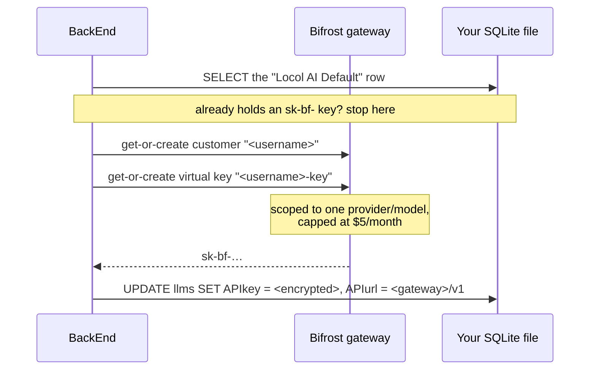

# How we look after LLM API keys

This is a plain-English explanation of what happens to the API keys that let Locol Content AI
talk to an AI provider — how they're stored, and how the production deployment avoids
handing most of them out in the first place. It's written so you don't need a security
background to follow it. Every claim links to the code that backs it, so a developer can
check the explanation against reality.

It completes a set of three. [password-hashing.md](./password-hashing.md) covers proving
who you are, [jwt.md](./jwt.md) covers staying logged in afterwards, and this one covers
the credential that costs money every time you press a button.

---

## Table of contents

- [1. The short version](#1-the-short-version)
- [2. Why this is encryption, not hashing](#2-why-this-is-encryption-not-hashing)
- [3. The lock — what Fernet does](#3-the-lock--what-fernet-does)
- [4. Every way a key gets into the drawer](#4-every-way-a-key-gets-into-the-drawer)
- [5. Taking it back out — two very different answers](#5-taking-it-back-out--two-very-different-answers)
- [6. The key to the drawer](#6-the-key-to-the-drawer)
- [7. The problem the drawer doesn't solve](#7-the-problem-the-drawer-doesnt-solve)
- [8. What a virtual key actually is](#8-what-a-virtual-key-actually-is)
- [9. Budgets — the spending limit](#9-budgets--the-spending-limit)
- [10. Scopes — the one shop it works at](#10-scopes--the-one-shop-it-works-at)
- [11. How a user gets their card](#11-how-a-user-gets-their-card)
- [12. The on/off switch](#12-the-onoff-switch)
- [13. Where the code lives](#13-where-the-code-lives)
- [14. What this protects against — and what it doesn't](#14-what-this-protects-against--and-what-it-doesnt)

---

## 1. The short version

An LLM API key is not a password. It's closer to a **company credit card**: it doesn't
identify anyone, it doesn't need a username alongside it, and whoever is holding it can
spend real money against our provider account until someone notices. There's no login
screen protecting it — the string *is* the authority.

So there are two separate defences in this codebase, doing two different jobs:

| Defence | The analogy | What it stops |
|---|---|---|
| **Encryption at rest** (sections 3–6) | The card lives in a locked drawer | Someone who walks off with the database file gets scrambled text, not a usable key |
| **The Bifrost gateway** (sections 7–12) | Each person gets *their own* card, with a $5 monthly limit, that only works at one shop | Someone who does get a key can't spend much, can't spend it anywhere else, and can be cut off without touching anyone else |

The second one is the more interesting half, and it's the half that only exists in
production. It means that in a normal deployment, **the vast majority of users have
never been given a real provider key at all** — only a capped stand-in that is worthless
outside our own gateway.

The two halves meet in one line of code: the stand-in Bifrost issues is written back
into the database through the same lock as everything else
([bifrost_manager.py:541](../BackEnd/src/bifrost_manager.py#L541)).

## 2. Why this is encryption, not hashing

If you've read [password-hashing.md](./password-hashing.md), the obvious question is why
API keys aren't shredded the same way passwords are.

Because we need them back. A password only ever has to be *checked* — the server can
confirm you typed the right one without ever knowing what it is. An API key has to be
*presented*: when you ask for some text to be generated, the BackEnd must put the actual
key on an actual HTTP request to the actual provider. You can't do that with confetti.

So this is a lock, not a shredder, and it's reversible by design. That's the whole
distinction, and the project uses all three tools side by side:

| Tool | Used for | Guarantee |
|---|---|---|
| **bcrypt** hashing | Passwords ([password-hashing.md](./password-hashing.md)) | One-way. Nothing can read it back, by design. |
| **Fernet** encryption | Stored LLM API keys (this document) | Reversible, deliberately — the app must read the key back to call the provider. |
| **RS256** signing + **ECDH-ES+A256KW** encryption | Session tokens ([jwt.md](./jwt.md)) | Both, stacked: the signature makes the token forgeable by nobody, the encryption makes it readable only by `BackEnd`. |

Reversible is a weaker promise than one-way, and it's worth being blunt about why: a
lock implies a key exists somewhere, and section 6 is about where that key lives and how
badly things go if you lose it.

## 3. The lock — what Fernet does

The whole locking mechanism is one 41-line file,
[`BackEnd/src/db_crypto.py`](../BackEnd/src/db_crypto.py). Locking up a value is three
lines ([:23-27](../BackEnd/src/db_crypto.py#L23-L27)):

```python
def encrypt_value(value):
    """Encrypt a string value for storage. Falsy values pass through unchanged."""
    if not value:
        return value
    return _fernet().encrypt(value.encode()).decode()
```

**Fernet** is a recipe rather than an algorithm — a standard combination of two
well-understood pieces, so that nobody here had to make cryptographic choices by hand.
It uses **AES-128-CBC** to make the value unreadable, and **HMAC-SHA256** to make it
tamper-evident. That second half matters more than it sounds: it means a stored value
can't be quietly *altered* either. Change one character of the ciphertext in the
database and decryption fails outright rather than producing a different, plausible key.

Two details of that snippet are load-bearing:

**An empty key stays empty.** `if not value: return value` — a blank `APIkey` column
stays blank rather than becoming an encrypted blob of nothing. Several LLM styles
(`google-vertex` and friends) authenticate through the ambient environment and have no
key to store at all.

**One lock for the whole application.** The key is read from disk once and cached for
the life of the process ([:14-16](../BackEnd/src/db_crypto.py#L14-L16)):

```python
@lru_cache(maxsize=1)
def _fernet() -> Fernet:
    return Fernet(_load_key())
```

There is one key for every user, not one per user, and because of that cache a replaced
key file needs a BackEnd restart before it takes effect. The file itself is
`db_encryption.key`, inside the directory named by `LOCOL_DB_ENCRYPTION_KEY_LOCATION`
(default `'../keys'`, [:7-11](../BackEnd/src/db_crypto.py#L7-L11)).

## 4. Every way a key gets into the drawer

The value being protected is the `APIkey` column of the `llms` table — and that table
lives in **your own** SQLite file, `db/users/<user_id>.sqlite`, not a shared one. There
are exactly four ways a value gets into that column, and all four go through
`encrypt_value`:

| How | Where |
|---|---|
| You paste a key into Config Manager | [`create_llm`](../BackEnd/src/config_manager.py#L74-L88) — config_manager.py:81 |
| You edit an existing one | [`update_llm`](../BackEnd/src/config_manager.py#L90-L117) — config_manager.py:104 |
| Seeding the defaults from YAML at first run | [load_llms.py:71](../BackEnd/src/load_llms.py#L71) |
| Bifrost writing back a virtual key | [bifrost_manager.py:541](../BackEnd/src/bifrost_manager.py#L541) |

(A fifth, [`repair_user_config_data.py:58`](../scripts/repair_user_config_data.py#L58),
is a maintenance script rather than something the running app does.)

The point of listing them is that there is no fifth door. Nothing in the application
writes a raw key to that column, which is what makes the guarantee in section 14
checkable rather than aspirational.

## 5. Taking it back out — two very different answers

Here's the part worth slowing down for. The same stored value gets decrypted for two
different audiences, and they get different answers on purpose.

**To call the provider, we need the real thing.** When you generate something,
[llm.py:460-470](../BackEnd/src/llm.py#L460-L470) unlocks the key in full:

```python
try:
    result["APIkey"] = decrypt_value(result["APIkey"])
except UndecryptableValue:
    conn.close()
    raise HTTPException(status_code=500, detail=...)
```

That plaintext exists as a local variable for the duration of one request, is handed to
the provider client, and is never written anywhere. Even the debug logging refuses to
print it — [llm.py:346-348](../BackEnd/src/llm.py#L346-L348) runs it through
[`mask_api_key`](../BackEnd/src/llm.py#L57) first.

Note what happens when the key *won't* open: it raises. There is no fallback, no guess,
and nothing gets written back. That matters enough to have its own paragraph in
section 6.

**To show it to a human, we deliberately break it.**
[`get_all_llms`](../BackEnd/src/config_manager.py#L48-L72) — the function behind the
Config Manager screen — unlocks the key and then *puts the disguise back on* before the
value ever leaves the server ([config_manager.py:70](../BackEnd/src/config_manager.py#L70)):

```python
row["APIkey"] = _mask_api_key(plaintext)
```

[`_mask_api_key`](../BackEnd/src/config_manager.py#L40-L46) leaves the last four
characters and replaces everything before them with bullets — enough to recognise *which*
key you configured, useless to anyone reading over your shoulder or intercepting the
response. The docstring states the rule outright
([config_manager.py:52-53](../BackEnd/src/config_manager.py#L52-L53)): "the real value is
never sent to clients."

A row whose key won't decrypt is shown as `(unreadable - re-enter this key)` rather than
taking down the whole list — deliberately not a blank, which would read as "no key set"
when in fact there is one and we simply can't open it.

This is why the Config Manager can't show you a key you've forgotten. It isn't a
limitation to be fixed — it's the feature. The only way to get a real key out of the
system is to be the BackEnd, in the middle of making a provider call.

## 6. The key to the drawer

The key is generated once per deployment by either of two equivalent scripts —
[`generate-db-encryption-key.sh`](../scripts/generate-db-encryption-key.sh) (OpenSSL) or
[`generate-db-encryption-key.ps1`](../scripts/generate-db-encryption-key.ps1) (pure .NET,
so stock Windows PowerShell needs no OpenSSL install). Both write the same single file:

| File | Contents |
|---|---|
| `keys/db_encryption.key` | 32 cryptographically random bytes in URL-safe base64, `chmod 600` / restricted ACL |

In Kubernetes it's the `locol-ai-db-key` secret rather than a file you copy up, mounted
into the pod — see [deploy-k8s.md](./deploy-k8s.md#4-generate-keys-create-secrets-and-the-question-sets-configmap).

**What happens if it's the wrong key.** Nothing clever, and that's the design.
[`decrypt_value`](../BackEnd/src/db_crypto.py#L30-L45) raises `UndecryptableValue` and
the caller deals with it: generation returns an error naming the LLM, the Config Manager
shows that row as unreadable, and **the stored value is left exactly as it was**.

The temptation here is to treat a value that won't decrypt as one that was never
encrypted in the first place, and quietly re-encrypt it. This project used to do exactly
that, and the trap is that "was never encrypted" and "I have the wrong key" look
identical from inside the `except`. Guessing meant that pointing the app at the wrong key
didn't produce an error — it produced a *rewrite*, replacing recoverable ciphertext with
scrambled bytes. So the helpers now refuse to guess, and neither of them ever hands back
the raw stored value:

| Helper | Answer when it can't decrypt |
|---|---|
| [`decrypt_value`](../BackEnd/src/db_crypto.py#L30-L45) | Raises. For callers that need the actual key. |
| [`decrypt_or_none`](../BackEnd/src/db_crypto.py#L48-L61) | `None`. For callers scanning for a `sk-bf-` prefix, where unreadable simply isn't a match. |

> **This key is not disposable.**
>
> Regenerating the JWT keypair ([jwt.md §9](./jwt.md#9-the-keys)) is cheap — everyone
> logs in again and nothing is lost. This key is the opposite. It protects data at rest,
> there is **one key for all users**, there is **no rotation path anywhere in the
> codebase**, and there is **no backup other than the file itself**.
>
> Lose it or replace it after real keys have been stored and those keys are
> unrecoverable. You will at least be *told* — every read fails loudly and the stored
> values are left intact, so pointing the app back at the right key fixes everything.
> But if the right key is gone, nothing in this codebase can recover what it protected.
>
> Back the file up out of band before storing anything real, and only use `--force` /
> `-Force` on a fresh install. This is why the installer never forces.

---

## 7. The problem the drawer doesn't solve

Everything so far protects a key *in storage*. It says nothing about what that key can
do once it's legitimately in use — and the default arrangement has a real problem.

Out of the box, every user's default LLM row is seeded from
`BackEnd/config/default/llms/llm.yaml` with **the same shared provider key**, talking
straight to the provider. That key is encrypted at rest, so the drawer is doing its job.
But:

- **No per-user visibility.** Every request from every user bills to one credential.
  Provider-side, there is one customer: us.
- **No per-user limit.** One user with a runaway script spends everyone's budget.
- **One key, all the exposure.** Anyone who does obtain that key holds the credential
  that bills the entire deployment, and revoking it cuts off every user at once.

Locking the company card in a drawer doesn't help if the whole company shares one card.

**[Bifrost](https://docs.getbifrost.ai/)** is the answer to that — an LLM gateway
deployed alongside the app ([`bifrost/k8s/`](../bifrost/k8s/)) that every model call is
routed through instead of going to the provider directly. All the provisioning logic on
our side is one module,
[`BackEnd/src/bifrost_manager.py`](../BackEnd/src/bifrost_manager.py).

## 8. What a virtual key actually is

One sentence carries this entire section, and the codebase states it in three separate
places ([bifrost_manager.py:22-24](../BackEnd/src/bifrost_manager.py#L22-L24),
[01-configmap.yaml:54-57](../k8s/01-configmap.yaml#L54-L57), and again in
[deploy-k8s.md](./deploy-k8s.md)) because it is the thing everyone gets wrong:

> **A virtual key carries an authorization scope, never provider credentials.**

A virtual key looks like `sk-bf-…`
([`VK_PREFIX`](../BackEnd/src/bifrost_manager.py#L68)) and it is **not a provider key**.
It is not a re-wrapped provider key, and it does not contain one. It is a name that our
own gateway recognises, and it means precisely nothing to anyone else. Stolen and taken
elsewhere, it buys the thief nothing at all; used against our gateway, it buys them at
most the remainder of that one user's monthly budget, on one model.

The real provider key exists exactly once in the whole deployment: inside Bifrost, from
the `bifrost-secrets` Kubernetes Secret
([bifrost/k8s/02-deployment.yaml:78-97](../bifrost/k8s/02-deployment.yaml#L78-L97)). It
is never handed to the application, never written to a user's database, and never leaves
the gateway pod.

Back to the analogy: the shared provider key was one company credit card, photocopied.
A virtual key is a card issued in one employee's name, with a limit, that only works at
one shop — and the company account number isn't printed on it.

That also explains a failure mode that catches everyone deploying this the first time:
because the virtual key carries no credentials, **Bifrost itself must separately be
configured with a working provider key**, or every provisioned user's LLM fails on first
use. That's a two-part setup — the Secret supplies the credential's value, and a provider
entry inside Bifrost references it by name — and it's spelled out step by step in
[deploy-k8s.md](./deploy-k8s.md).

## 9. Budgets — the spending limit

Every virtual key is created with a spend cap attached, from
[`_budgets()`](../BackEnd/src/bifrost_manager.py#L312-L334):

```python
return [{"max_limit": max_limit, "reset_duration": BIFROST_BUDGET_RESET_DURATION}]
```

Two settings control it, and production ships them as `"5"` and `"1M"` —
**five dollars per user per month** ([01-configmap.yaml:72-78](../k8s/01-configmap.yaml#L72-L78)):

| Setting | Meaning |
|---|---|
| `LOCOL_BIFROST_BUDGET_MAX_LIMIT` | The cap, in dollars |
| `LOCOL_BIFROST_BUDGET_RESET_DURATION` | The window it resets over — one of `30s`, `5m`, `1h`, `1d`, `1w`, `1M`, `1Q` |

Two behaviours here surprise people, and both are deliberate:

**A bad value means no cap, not a crash.** If the limit is missing, unparseable, or not
positive, `_budgets()` logs a warning and returns `[]`, which creates an **uncapped**
key. That's a considered trade: the alternative is a typo'd config file breaking user
registration entirely. The comment at
[:317-320](../BackEnd/src/bifrost_manager.py#L317-L320) says as much — "it costs an
uncapped key rather than a failed registration." Worth knowing, because it means a
malformed setting fails in the *expensive* direction rather than the visible one.

**Changing the numbers doesn't reach existing users.** The budget is set at key
*creation*. Raise the limit in the ConfigMap and only people who register afterwards get
the new figure; everyone else keeps the budget their key was born with, changeable only
inside Bifrost itself.

## 10. Scopes — the one shop it works at

Alongside the budget, each key is pinned to a single provider and a single model, by
[`_provider_configs()`](../BackEnd/src/bifrost_manager.py#L351-L371):

```python
return [{
    "provider": provider,
    "weight": 1.0,
    "allowed_models": [bare_model],
    "key_ids": list(ALL_PROVIDER_KEYS),
}]
```

The model string is Bifrost's `"<provider>/<model>"` form — production runs
`deepseek/deepseek-v4-flash` ([01-configmap.yaml:70](../k8s/01-configmap.yaml#L70)) —
and it does double duty: it's both what goes on the wire *and* what the user's key is
permitted to reach.

The rule that makes this fiddly is that **Bifrost denies by default at all three
levels**. An empty scope permits nothing, rather than everything. That's the safe
default, but it means an under-specified key doesn't quietly become permissive — it
becomes useless, in two distinct ways the module goes out of its way to prevent:

| Missing | What the user sees |
|---|---|
| No `provider_configs` at all | `403 provider_blocked` |
| Provider and model named, but no `key_ids` | `no keys found for provider` |

Both only show up *after* provisioning has reported success, which is why
[`_ensure_key_scope()`](../BackEnd/src/bifrost_manager.py#L416-L477) exists: it revisits
an existing key and widens it until it can actually serve the model on the user's row.
It merges into the existing `provider_configs` array rather than writing its own entry
over the top, because Bifrost replaces that array wholesale — a blind write would delete
the entries for every other provider, along with their server-assigned ids and budgets.
It also only fills in *empty* fields, so a deliberate pin to specific upstream keys is
left alone.

## 11. How a user gets their card

Provisioning hangs off
[`ensure_user_defaults_seeded`](../BackEnd/src/db_manager.py#L158-L198), which ends by
calling into the Bifrost module
([db_manager.py:194-198](../BackEnd/src/db_manager.py#L194-L198)):

```python
# Give the default LLM its Bifrost virtual key if it hasn't got one - including
# for users who registered before Bifrost was configured, or whose row was reset
# by a config resync. No-op once the row holds a key, and it never raises.
from bifrost_manager import provision_default_llm
provision_default_llm(user_id)
```



The write that lands is
[`_write_default_llm`](../BackEnd/src/bifrost_manager.py#L529-L545) — one statement, so
the row can never be left half-provisioned:

```python
"UPDATE llms SET APIkey = ?, APIstyle = 'openai', APIurl = ?, model = ? WHERE id = ?",
(encrypt_value(vk_value), api_url, model, llm_id),
```

Three things happen there. The row is pointed at the gateway (`<BIFROST_URL>/v1`)
instead of the provider; `APIstyle` becomes `'openai'` because that's the protocol
Bifrost speaks; and the virtual key goes through `encrypt_value` on its way in — the
sentence that joins the two halves of this document. Even the disposable, capped,
gateway-only key gets locked in the drawer.

Several design choices around that are worth knowing, because each was made for a
reason:

**It runs on every authenticated request, not just at registration.** That sounds
wasteful and isn't: once the row holds a key, the whole thing costs one `SELECT`
([`_needs_provisioning`](../BackEnd/src/bifrost_manager.py#L548-L560) checks for the
`sk-bf-` prefix), plus a single scope check per pod lifetime. The payoff is that users
who registered *before* Bifrost was configured get picked up automatically, with no
backfill script.

**It finds the row by name.** `"Locol AI Default"`
([`DEFAULT_LLM_MARKER_NAME`](../BackEnd/src/bifrost_manager.py#L79)) is the entire test.
Unlike a guess based on position or id, a name can never accidentally match an LLM you
configured yourself — so provisioning is structurally incapable of overwriting your own
key.

**Everything is get-or-create, under a per-user lock.**
([:86-100](../BackEnd/src/bifrost_manager.py#L86-L100)) A single page load fires several
requests in parallel; without the lock they'd race into creating duplicate customers and
keys. And because an existing key is *reused* rather than replaced, a row that somehow
lost its key is repaired with the key that user already has, instead of accumulating a
new one in Bifrost every time.

**It never raises.** A Bifrost outage during signup logs a warning and leaves the row as
seeded — your registration still succeeds. Failures then back off for 300 seconds
(`BIFROST_RETRY_INTERVAL`) so an outage doesn't add a timed-out HTTP call to every
request.

**Response bodies are never logged.** The create response contains the key itself, so
[`_request()`](../BackEnd/src/bifrost_manager.py#L182-L202) logs status codes and a
bounded slice of *error* bodies only — never a success body.

**A config resync can't undo it.**
[`load_llms.sync_table`](../BackEnd/src/load_llms.py#L52-L60) skips any row holding an
`sk-bf-` key when syncing the YAML defaults back over, since the YAML only knows the old
shared seed values. Without that check, a resync would revert the routing and strand a
live key in Bifrost.

## 12. The on/off switch

The whole feature is gated by `LOCOL_BIFROST_ENABLED`, resolved at
[bifrost_manager.py:47-48](../BackEnd/src/bifrost_manager.py#L47-L48):

```python
BIFROST_ENABLED = bool(BIFROST_URL) and _ENABLED_RAW in ('', 'true', '1', 'yes')
```

Unset, it falls back to "is a gateway URL configured?", which is how this was gated
before the flag existed. That keeps a cluster on an older ConfigMap behaving as it did,
and keeps local development — which sets neither — switched off, using the seeded
provider key directly.

One asymmetry to be aware of: **turning it off only stops new provisioning.** Users who
already hold a virtual key keep routing through the gateway, because the key is sitting
in their database row. Don't tear Bifrost down without first repointing those rows.

When provisioning is skipped, it says so exactly once per process
([`_log_skip_once`](../BackEnd/src/bifrost_manager.py#L139-L160)) — a `[Bifrost]` line
on stdout naming which of the three reasons applies. Registering a user and seeing *no*
`[Bifrost]` line at all means the code isn't running (a stale image), rather than
failing quietly.

## 13. Where the code lives

| Concern | Location |
|---|---|
| Locking a value | [`encrypt_value`](../BackEnd/src/db_crypto.py#L23-L27) — db_crypto.py:23-27 |
| Unlocking one, strictly | [`decrypt_value`](../BackEnd/src/db_crypto.py#L30-L45) — raises `UndecryptableValue` |
| Unlocking one while scanning | [`decrypt_or_none`](../BackEnd/src/db_crypto.py#L48-L61) — returns `None` if unreadable |
| Loading the encryption key | [`_load_key`](../BackEnd/src/db_crypto.py#L7-L11) / [`_fernet`](../BackEnd/src/db_crypto.py#L14-L16) |
| Masking for display | [`_mask_api_key`](../BackEnd/src/config_manager.py#L40-L46) — config_manager.py:40-46 |
| Masking for logs | [`mask_api_key`](../BackEnd/src/llm.py#L57) — llm.py:57 |
| Saving a key you typed | [`create_llm`](../BackEnd/src/config_manager.py#L74-L88) / [`update_llm`](../BackEnd/src/config_manager.py#L90-L117) |
| Reading a key to call a provider | [llm.py:460-470](../BackEnd/src/llm.py#L460-L470) |
| Generating the encryption key | [generate-db-encryption-key.sh](../scripts/generate-db-encryption-key.sh) / [.ps1](../scripts/generate-db-encryption-key.ps1) |
| Provisioning entry point | [`provision_default_llm`](../BackEnd/src/bifrost_manager.py#L619-L702) — bifrost_manager.py:619-702 |
| Where it's called from | [`ensure_user_defaults_seeded`](../BackEnd/src/db_manager.py#L158-L198) — db_manager.py:194-198 |
| Creating the virtual key | [`_ensure_virtual_key`](../BackEnd/src/bifrost_manager.py#L374-L394) / [`_create_virtual_key`](../BackEnd/src/bifrost_manager.py#L397-L413) |
| Budgets | [`_budgets`](../BackEnd/src/bifrost_manager.py#L312-L334) — bifrost_manager.py:312-334 |
| Scopes, and repairing them | [`_provider_configs`](../BackEnd/src/bifrost_manager.py#L351-L371) / [`_ensure_key_scope`](../BackEnd/src/bifrost_manager.py#L416-L477) |
| Gateway deployment | [bifrost/k8s/](../bifrost/k8s/) |
| App-side settings | [k8s/01-configmap.yaml:40-83](../k8s/01-configmap.yaml#L40-L83), wired in at [03-deployment.yaml:147-199](../k8s/03-deployment.yaml#L147-L199) |
| Operator setup guide | [deploy-k8s.md](./deploy-k8s.md), [deploy-local.md §4](./deploy-local.md#41-the-keys-it-generates) |

Supporting facts:

- The encryption library is [`cryptography`](https://pypi.org/project/cryptography/)'s
  `Fernet`; nothing here implements crypto by hand.
- Two Kubernetes secrets are involved and they're unrelated: `locol-ai-db-key` holds the
  encryption key the app uses, `bifrost-secrets` holds the upstream provider keys the
  gateway uses.
- Bifrost is **internal only** — a ClusterIP Service with no Ingress
  ([bifrost/k8s/02-deployment.yaml:5-8](../bifrost/k8s/02-deployment.yaml#L5-L8)). Port
  8080 serves both the proxy API and the admin UI, so exposing it publicly would hand out
  the provider configuration. Reach the UI with `kubectl port-forward`.
- The gateway has readiness and liveness probes on `/health`
  ([:98-112](../bifrost/k8s/02-deployment.yaml#L98-L112)) — unlike the app itself, which
  has none — because it sits in the request path of every model call.
- `LOCOL_BIFROST_TIMEOUT` (default 5s) bounds how long a signup can hang if the gateway
  is unreachable.

## 14. What this protects against — and what it doesn't

**A stolen database file yields nothing usable.** Walk off with someone's
`db/users/<id>.sqlite` and the `APIkey` column is ciphertext. Without the separate key
file, it stays that way.

**A leaked virtual key is a small, containable problem.** It's capped, pinned to one
model, meaningless outside our gateway, and revocable in Bifrost without touching the
user's account, their data, or anyone else's access.

**The real provider credential exists in one place.** Not in any user's database, not in
the application's memory, not in a config file the app reads — only inside the gateway
pod, from its own Secret.

**It does not protect against someone who has both halves.** The database and
`db_encryption.key` together give up every key. They must not live in the same backup,
and the key file must not end up in the same snapshot as the volume it protects.

Some honest gaps in the current implementation:

> **One encryption key for everyone, and no rotation path.** Nothing in the codebase
> re-encrypts existing values under a new key. Replacing the file is not an operation the
> system supports — it's a data-loss event (§6).
>
> **Losing that key is still unrecoverable, it just isn't silent.** Every read of an
> affected row fails and says so, and nothing is overwritten, so the damage is limited to
> "these keys must be re-entered" rather than spreading. But no part of this codebase can
> recover a value once the key that encrypted it is gone.
>
> **There is no migration path for pre-encryption values.** The fallback that used to
> upgrade plaintext rows on read has been removed, along with the silent-overwrite risk
> that came with it. A row still holding an unencrypted key — if any survive — now reads
> as unreadable and must be re-entered.
>
> **The key file sits unencrypted on disk**, guarded only by file permissions and the
> Kubernetes secret mount — the same residual risk
> [jwt.md §11](./jwt.md#11-what-this-protects-against--and-what-it-doesnt) records for the
> JWT private key.
>
> **Bifrost's governance API is unauthenticated by default.**
> `LOCOL_BIFROST_ADMIN_TOKEN` is optional
> ([bifrost_manager.py:49-50](../BackEnd/src/bifrost_manager.py#L49-L50)) and unset in
> the shipped config. Left that way, anything that can reach the Service inside the
> cluster can mint virtual keys, read existing ones, and raise budgets. The only thing
> standing in front of that is the absence of an Ingress.
>
> **A misconfigured budget produces an uncapped key** rather than an error (§9), so the
> failure direction is "spends more than intended".
>
> **Budget changes are not retroactive.** Existing keys keep the budget they were created
> with, and changing it means going into Bifrost directly.
>
> **A user can opt out of all of this.** Nothing stops someone pasting their own provider
> key into Config Manager. It'll be encrypted at rest like everything else, but it
> bypasses the gateway completely — uncapped, unscoped, and invisible to per-user spend
> tracking.
>
> **Bifrost's own configuration lives on the `bifrost-storage` PVC.** It survives pod
> restarts, but not deleting the volume — and losing it means every provisioned user's
> LLM stops working until the provider entry is recreated.
